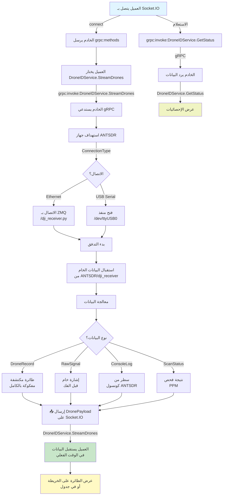
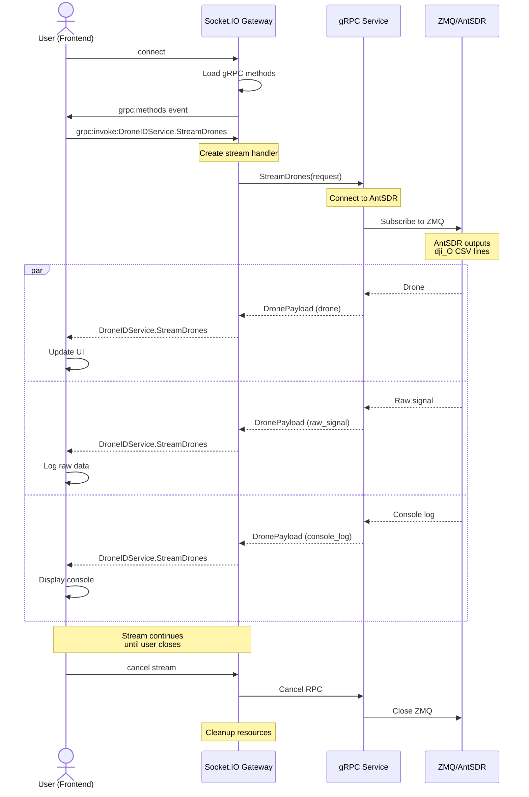
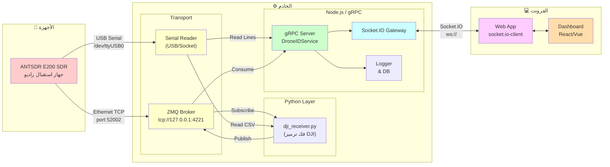
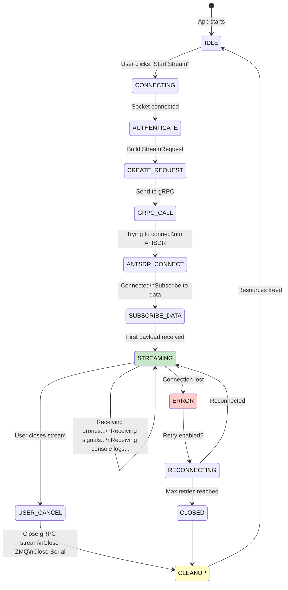
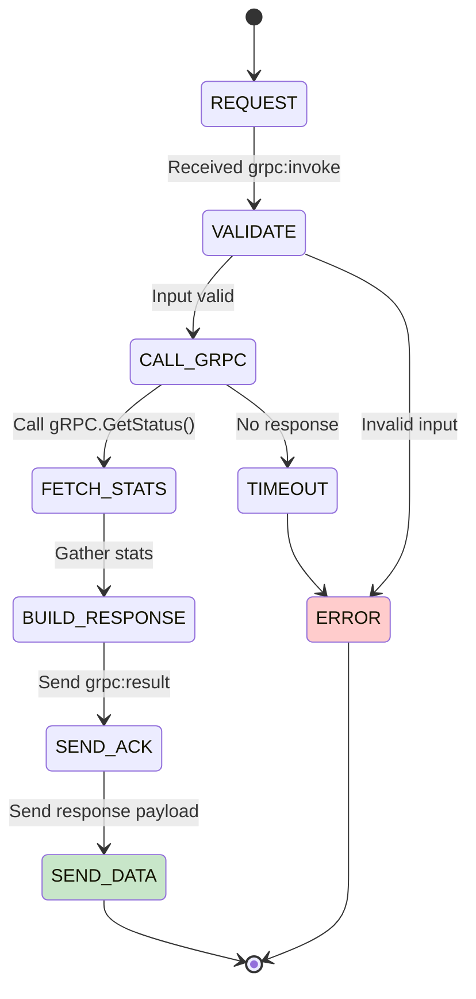
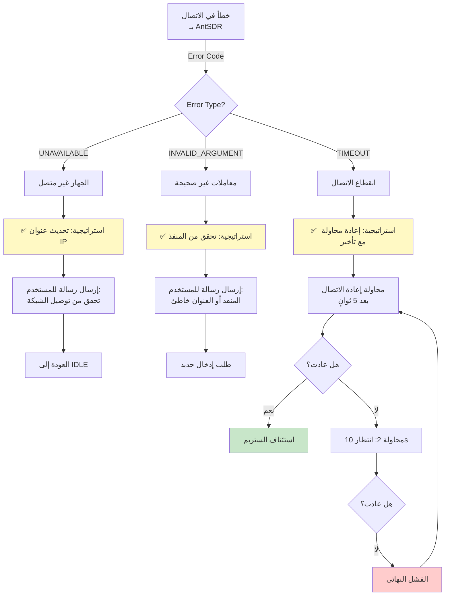
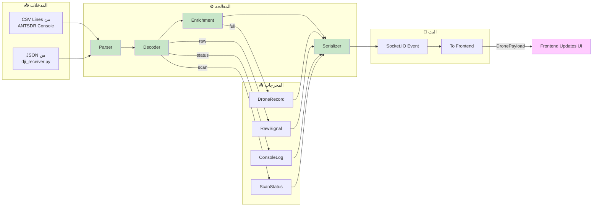
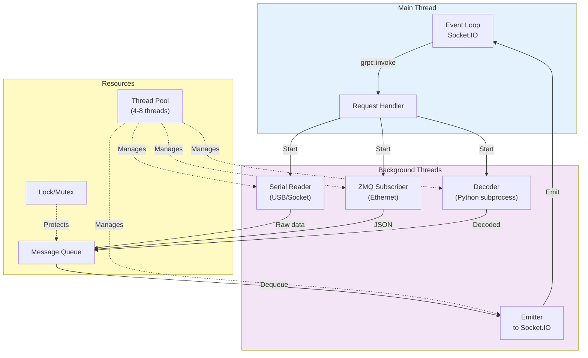
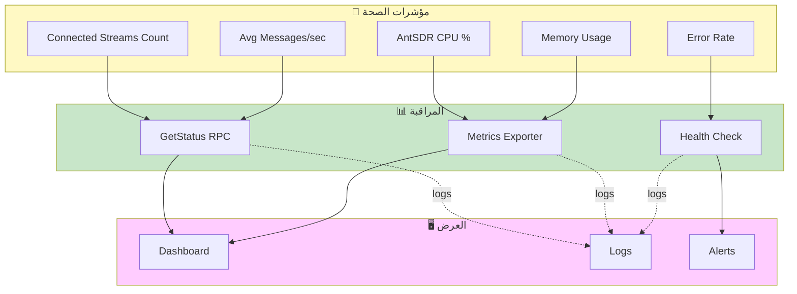
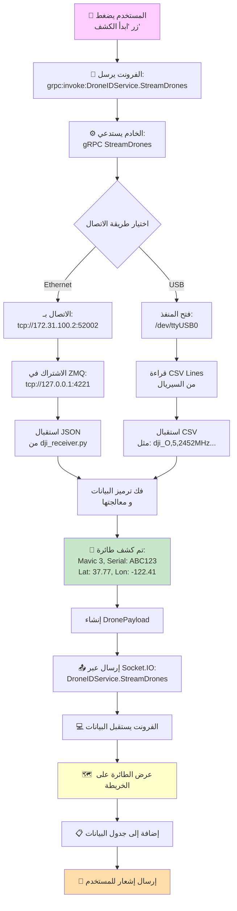

# المخططات والعمليات — خدمة DroneID

توثيق شامل للمخططات التدفقية والتزامن والعمليات الداخلية لخدمة DroneIDService.

---

## 1️⃣ المخطط التدفقي الكامل للعملية



---

## 2️⃣ مخطط التزامن (Concurrency Diagram)



---

## 3️⃣ مخطط هندسة النظام



---

## 4️⃣ دورة حياة الطلب (Request Lifecycle)

### 4.1) StreamDrones - طلب Streaming



### 4.2) GetStatus - طلب Unary



---

## 5️⃣ مخطط معالجة الأخطاء والاستعادة



---

## 6️⃣ مخطط تدفق البيانات الداخلي



---

## 7️⃣ مخطط التوازي والـ Threading



---

## 8️⃣ مخطط المراقبة والصحة



---

## 9️⃣ مثال عملي: تتبع طائرة من البداية



---

## 🔟 جدول مقارنة الأداء

### السيناريو الأول: Ethernet Mode

```
┌─────────────────────┬──────────┬──────────┬──────────┐
│ المقياس             │ الأفضل   │ الوسط    │ الأسوأ    │
├─────────────────────┼──────────┼──────────┼──────────┤
│ زمن الاتصال        │ < 0.5s   │ 1-2s     │ > 5s     │
│ تأخير الرسالة      │ < 100ms  │ 200-500ms│ > 1s     │
│ الذاكرة (per stream)│ < 5 MB   │ 10-20MB  │ > 50MB   │
│ CPU استهلاك        │ < 5%     │ 10-20%   │ > 50%    │
│ الاستقرار          │ 99.9%    │ 95%      │ < 90%    │
└─────────────────────┴──────────┴──────────┴──────────┘
```

### السيناريو الثاني: USB Serial Mode

```
┌─────────────────────┬──────────┬──────────┬──────────┐
│ المقياس             │ الأفضل   │ الوسط    │ الأسوأ    │
├─────────────────────┼──────────┼──────────┼──────────┤
│ زمن الاتصال        │ < 1s     │ 2-3s     │ > 10s    │
│ تأخير الرسالة      │ < 200ms  │ 400-800ms│ > 2s     │
│ الذاكرة (per stream)│ < 3 MB   │ 5-10MB   │ > 30MB   │
│ CPU استهلاك        │ < 3%     │ 5-10%    │ > 30%    │
│ الاستقرار          │ 99%      │ 90-95%   │ < 80%    │
└─────────────────────┴──────────┴──────────┴──────────┘
```

---

## 1️⃣1️⃣ قائمة التحقق من الجاهزية

- [ ] جهاز ANTSDR موصول فيزيائياً
- [ ] تشغيل dji_receiver.py (للوضع Ethernet)
- [ ] Ports والـ endpoints مفتوحة (52002, 4221)
- [ ] الفرونت يتصل بـ Socket.IO بنجاح
- [ ] الفرونت يستقبل `grpc:methods`
- [ ] طلب StreamDrones يأتي بـ acknowledgment
- [ ] أول `status_message` يصل دون تأخير
- [ ] عند الكشف، `DroneRecord` يصل مع البيانات الكاملة
- [ ] `GetStatus` يعود بـ uptime صحيح
- [ ] `GetAntSDRStatus` يظهر `connected: true`

---

## 📞 استكشاف الأخطاء

**المشكلة**: لا تصل أي بيانات
- **الحل**: تحقق من `GetAntSDRStatus.connected == true`

**المشكلة**: تأخير كبير بين الكشف والعرض
- **الحل**: راقب CPU استهلاك في الخادم

**المشكلة**: الذاكرة تنمو باستمرار
- **الحل**: قد يكون تسرب، أغلق الستريم واختبر مرة أخرى
