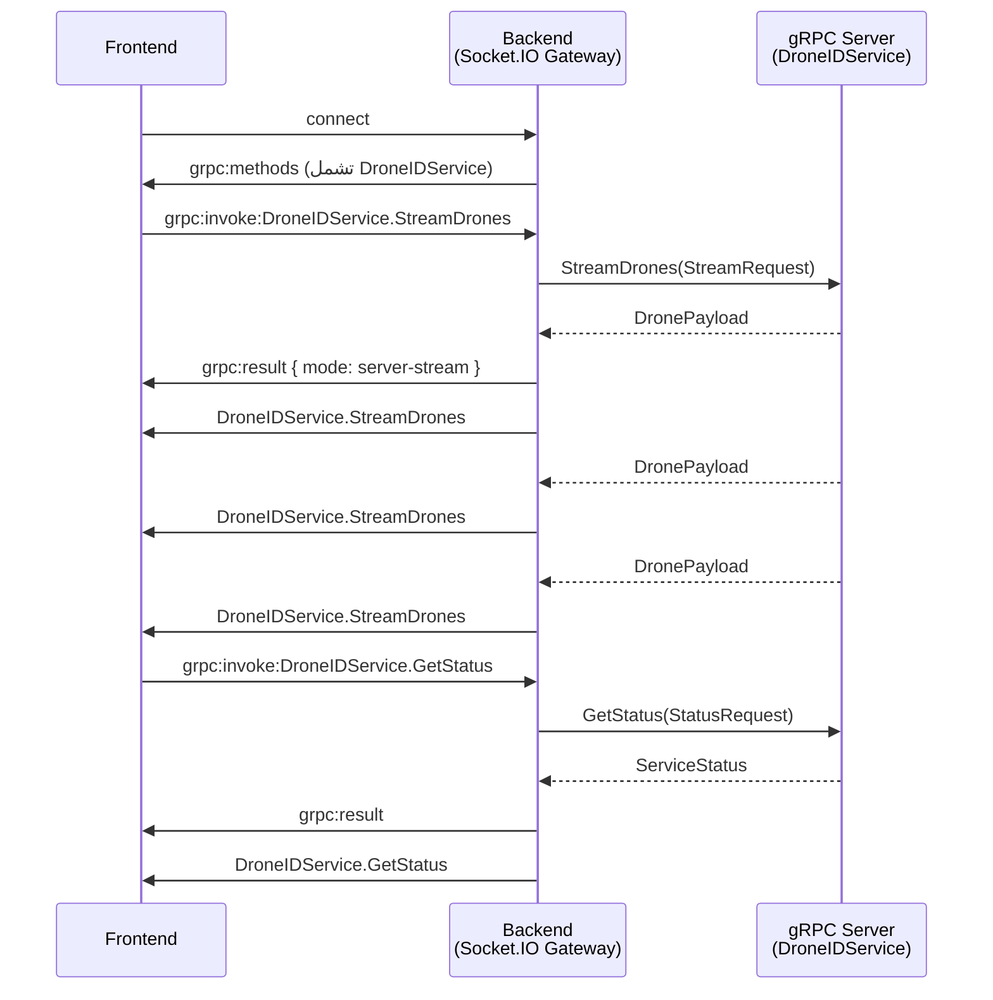

# خدمة DroneID — التوثيق الشامل

## 📋 نظرة عامة

خدمة **DroneIDService** متخصصة في كشف وتتبع الطائرات بدون طيار (خاصة طائرات DJI) باستخدام أجهزة استقبال راديو متقدمة (ANTSDR E200 SDR).

### المواصفات الأساسية:
- **الحزمة (Package)**: `droneid.v1`
- **الخدمة**: `DroneIDService`
- **نوع الاتصال الرئيسي**: Streaming (long-running RPC)
- **عدد Methods**: 3 طرق
- **حالات الاستخدام**: كشف الطائرات، متابعة الموقع، جمع البيانات الخام

---

## 1️⃣ شرح طرق الخدمة (Methods)

### 1.1) `StreamDrones` ⚡ (Streaming)

**النوع**: Server streaming RPC (الخادم يرسل البيانات بشكل مستمر)

**الوصف**: 
تفتح اتصالاً طويل الأجل مع الخادم يستقبل فيه تدفق مستمر من بيانات الطائرات المكتشفة. هذا الـ RPC يبقى مفتوحاً حتى يلغي العميل الطلب.

**الاستخدام**: 
- الحصول على قائمة مستمرة من الطائرات المكتشفة
- المراقبة اللحظية للإشارات الخام
- عرض أسجل وحدة التحكم (AntSDR) الحية
- متابعة حالة الاتصال بالجهاز

**معدل التحديث**: 
يعتمد على سرعة الكشف، عادة عدة رسائل في الثانية

---

### 1.2) `GetStatus` ⏹️ (Unary)

**النوع**: Unary RPC (طلب واحد، رد واحد)

**الوصف**: 
استعلام فوري عن صحة الخدمة والإحصائيات العامة، مثل عدد الطائرات المكتشفة والوقت المنقضي منذ بدء التشغيل.

**الاستخدام**: 
- التحقق من حالة الخدمة الكلية
- الحصول على الإحصائيات المتراكمة
- عرض معلومات المكون (Component Status)
- إرسال تنبيهات (Alerts)

**التأخير المتوقع**: مباشر (< 100ms)

---

### 1.3) `GetAntSDRStatus` ⚙️ (Unary)

**النوع**: Unary RPC (طلب واحد، رد واحد)

**الوصف**: 
استعلام فوري مخصص عن حالة جهاز ANTSDR الفيزيائي: هل متصل الآن؟ هل يعمل reader thread؟ آخر مرة تم كشف طائرة؟

**الاستخدام**: 
- التحقق من اتصال الجهاز الفيزيائي
- كشف مشاكل الأجهزة قبل أن تؤثر على الخدمة
- عرض معلومات الاتصال الحالية

**التأخير المتوقع**: فوري (< 50ms)

---

## 2️⃣ أنواع البيانات والـ Enums

### ConnectionType - نوع الاتصال

```proto
enum ConnectionType {
  CONNECTION_ETHERNET   = 0;  // TCP عبر الشبكة المحلية
  CONNECTION_USB_SERIAL = 1;  // اتصال مباشر عبر المسلسل/Socket
}
```

**الفرق**:
- **Ethernet**: الجهاز متصل عبر TCP، يعمل Python decoding script (dji_receiver.py)، البيانات تأتي عبر ZMQ
- **USB Serial**: اتصال مباشر عبر `/dev/ttyUSB0` أو socket، قراءة CSV lines مباشرة

---

### Protocol - بروتوكول الطائرات

```proto
enum Protocol {
  PROTOCOL_DJI           = 0;  // DJI proprietary (O2, O3, O4)
  PROTOCOL_UNIVERSAL_RID = 1;  // ASTM F3411 / OpenDroneID (قياسي)
}
```

---

### الرسائل الأساسية (Messages)

#### `StreamRequest` - معاملات طلب الستريم

| الحقل | النوع | اختياري؟ | الوصف |
|-------|------|---------|-------|
| `connection_type` | ConnectionType | ✅ | طريقة الاتصال (الافتراضي: Ethernet) |
| `protocol` | Protocol | ✅ | بروتوكول التصفية (الافتراضي: DJI) |
| `antsdr_ip` | string | ✅ | عنوان ANTSDR (الافتراضي: 172.31.100.2) |
| `listen_port` | int32 | ✅ | منفذ الاستماع (الافتراضي: 52002) |
| `zmq_endpoint` | string | ✅ | نقطة ZMQ (الافتراضي: tcp://127.0.0.1:4221) |
| `serial_port` | string | ✅ | منفذ المسلسل (الافتراضي: /dev/ttyUSB0) |
| `baud_rate` | int32 | ✅ | سرعة البود (الافتراضي: 115200) |

---

#### `DroneRecord` - تسجيل الطائرة المكتشفة

هذه هي الرسالة الرئيسية التي تصل عند كشف طائرة. تحتوي على كل البيانات المتاحة:

| الحقل | النوع | الوصف |
|-------|------|-------|
| `serial` | string | رقم المسلسل الفريد للطائرة |
| `protocol` | string | نص الـ protocol (مثل "DJI-O2") |
| `drone_lat`, `drone_lon` | double | موقع GPS للطائرة (WGS-84) |
| `altitude_m` | double | الارتفاع بالمتر |
| `speed_ms` | double | السرعة الأفقية (م/ث) |
| `home_lat`, `home_lon` | double | موقع النقطة الأصلية (نقطة الإقلاع) |
| `pilot_lat`, `pilot_lon` | double | موقع الطيار/جهاز التحكم |
| `rssi` | float | قوة الإشارة (dBm، قيمة سالبة) |
| `description` | string | اسم الطراز (مثل "Mavic 3") |
| `timestamp_ms` | int64 | توقيت Unix بالميلي ثانية |
| `motor_on` | bool | هل المحركات تعمل؟ |
| `in_air` | bool | هل الطائرة في الجو؟ |
| `gps_valid` | bool | هل GPS صحيح؟ |
| `v_north_cms`, `v_east_cms`, `v_up_cms` | int32 | مكونات السرعة (NED، سم/ث) |

---

#### `RawSignal` - الإشارة الخام قبل فك الترميز

```proto
message RawSignal {
  string protocol;          // "DJI-O2" مثلاً
  float rssi;              // قوة الإشارة
  string model;            // اسم الجهاز
  string serial;           // رقم المسلسل (أو ID مشتق)
  double lat, lon;         // الموقع
  double altitude_m;       // الارتفاع
  double speed_ms;         // السرعة
  string raw_line;         // السطر الخام من CSV (أول 120 حرف)
  int64 timestamp_ms;      // الوقت
  float frequency_mhz;     // التردد المكتشف
}
```

---

#### `ConsoleLog` - سجل الكونسول الحي

```proto
message ConsoleLog {
  string line;   // النص الخام من مخرجات ANTSDR
  string level;  // التصنيف: "raw" | "drone" | "status" | "err" | "grpc"
}
```

---

#### `ScanStatus` - نتيجة دورة الفحص

```proto
message ScanStatus {
  string scan_time;        // الوقت من ANTSDR
  float ppm;              // انزياح التردد
  bool detected;          // هل تم كشف طائرة في هذه الدورة؟
  int64 timestamp_ms;     // الوقت على الخادم
}
```

---

#### `DronePayload` - الحمولة الموحدة (الأهم!)

هذه هي الرسالة التي تصل على الستريم، وتحتوي على **أحد** الحقول التالية فقط:

```proto
message DronePayload {
  int64 sequence;        // عداد لكشف الفجوات
  int64 timestamp_ms;    // وقت الخادم
  
  oneof payload {
    DroneRecord drone;          // رسالة الطائرة المكتشفة
    string status_message;      // رسالة حالة نصية
    RawSignal raw_signal;       // الإشارة الخام
    ConsoleLog console_log;     // سطر من الكونسول
    AntSDRStatus hardware_status;  // تحديث حالة الجهاز
    ScanStatus scan_status;     // نتيجة الفحص
  }
}
```

---

#### `ServiceStatus` - حالة الخدمة الكلية

```proto
message ServiceStatus {
  bool running;           // هل الخدمة تعمل؟
  string connection_type; // نوع الاتصال الحالي
  string protocol;        // البروتوكول الحالي
  int64 drone_count;      // إجمالي الطائرات المكتشفة
  int64 uptime_ms;        // وقت التشغيل الكلي
  int64 active_streams;   // عدد الستريمات المفتوحة حالياً
  string error;           // رسالة خطأ (إن وجدت)
}
```

---

#### `AntSDRStatus` - حالة جهاز ANTSDR

```proto
message AntSDRStatus {
  bool busy;              // هل الـ thread يعمل؟
  bool connected;         // هل الاتصال نشط؟
  string source;          // المنفذ الحالي (/dev/ttyUSB0 مثلاً)
  int64 last_signal_ms;   // آخر وقت كشف طائرة
  int64 drone_count;      // عدد الطائرات في هذه الجلسة
}
```

---

## 3️⃣ أحداث Socket.IO

عندما يتصل الفرونت بالباك، يتلقى قائمة Methods تتضمن DroneIDService. إليك كيفية التفاعل:

### التسلسل الزمني



---

### 🔴 الحدث: بدء الستريم

**اسم الحدث (Request)**:
```
grpc:invoke:DroneIDService.StreamDrones
```

**الـ Payload المرسل**:
```json
{
  "connection_type": "CONNECTION_ETHERNET",
  "protocol": "PROTOCOL_DJI",
  "antsdr_ip": "172.31.100.2",
  "listen_port": 52002,
  "zmq_endpoint": "tcp://127.0.0.1:4221"
}
```

أو (USB Serial):
```json
{
  "connection_type": "CONNECTION_USB_SERIAL",
  "protocol": "PROTOCOL_DJI",
  "serial_port": "/dev/ttyUSB0",
  "baud_rate": 115200
}
```

**الاستجابة الأولى (Acknowledgment)**:

الحدث: `grpc:result`
```json
{
  "success": true,
  "mode": "server-stream",
  "message": "DroneID stream started"
}
```

---

### 🟢 الحدث: تدفق البيانات المستمر

**اسم الحدث**:
```
DroneIDService.StreamDrones
```

**مثال الـ Payload - كشف طائرة**:
```json
{
  "sequence": 42,
  "timestamp_ms": 1719188400000,
  "drone": {
    "serial": "4AACJ3L002X9R2",
    "protocol": "DJI-O3",
    "drone_lat": 37.7749,
    "drone_lon": -122.4194,
    "altitude_m": 45.5,
    "speed_ms": 8.3,
    "home_lat": 37.7740,
    "home_lon": -122.4195,
    "pilot_lat": 37.7750,
    "pilot_lon": -122.4193,
    "rssi": -65.2,
    "description": "Mavic 3",
    "source": "tcp://127.0.0.1:4221",
    "timestamp_ms": 1719188400000,
    "motor_on": true,
    "in_air": true,
    "gps_valid": true,
    "home_set": true,
    "serial_valid": true,
    "v_north_cms": 320,
    "v_east_cms": 410,
    "v_up_cms": -50,
    "iq_decoded": true,
    "sequence_number": 1234,
    "state_info": "Flying"
  }
}
```

**مثال الـ Payload - رسالة حالة**:
```json
{
  "sequence": 0,
  "timestamp_ms": 1719188400000,
  "status_message": "AntSDR connected, waiting for drones..."
}
```

**مثال الـ Payload - إشارة خام**:
```json
{
  "sequence": 41,
  "timestamp_ms": 1719188399800,
  "raw_signal": {
    "protocol": "DJI-O2",
    "rssi": -70.5,
    "model": "Mini 2",
    "serial": "unknown",
    "lat": 37.7748,
    "lon": -122.4193,
    "altitude_m": 15.0,
    "speed_ms": 5.2,
    "raw_line": "dji_O,5,2452000000,30,-70.5,...",
    "timestamp_ms": 1719188399800,
    "frequency_mhz": 2452.0
  }
}
```

**مثال الـ Payload - سجل الكونسول**:
```json
{
  "sequence": 30,
  "timestamp_ms": 1719188395000,
  "console_log": {
    "line": "[2024-06-24 10:30:00] Connected to ANTSDR E200",
    "level": "status"
  }
}
```

**مثال الـ Payload - تحديث حالة الجهاز**:
```json
{
  "sequence": 5,
  "timestamp_ms": 1719188401000,
  "hardware_status": {
    "busy": true,
    "connected": true,
    "source": "/dev/ttyUSB0",
    "last_signal_ms": 1719188400000,
    "drone_count": 127
  }
}
```

**مثال الـ Payload - نتيجة الفحص**:
```json
{
  "sequence": 38,
  "timestamp_ms": 1719188393000,
  "scan_status": {
    "scan_time": "2024-06-24 10:29:52.456",
    "ppm": -12.3,
    "detected": true,
    "timestamp_ms": 1719188393000
  }
}
```

---

### 🔵 الحدث: الاستعلام عن حالة الخدمة

**اسم الحدث (Request)**:
```
grpc:invoke:DroneIDService.GetStatus
```

**الـ Payload المرسل**:
```json
{}
```

**الاستجابة**:

الحدث الأول - Acknowledgment:
```
grpc:result
```
```json
{
  "success": true,
  "mode": "unary"
}
```

الحدث الثاني - البيانات:
```
DroneIDService.GetStatus
```
```json
{
  "running": true,
  "connection_type": "CONNECTION_ETHERNET",
  "protocol": "PROTOCOL_DJI",
  "drone_count": 237,
  "uptime_ms": 3600000,
  "active_streams": 3,
  "error": ""
}
```

---

### 🟣 الحدث: الاستعلام عن حالة ANTSDR

**اسم الحدث (Request)**:
```
grpc:invoke:DroneIDService.GetAntSDRStatus
```

**الـ Payload المرسل**:
```json
{}
```

**الاستجابة**:

الحدث الأول - Acknowledgment:
```
grpc:result
```
```json
{
  "success": true,
  "mode": "unary"
}
```

الحدث الثاني - البيانات:
```
DroneIDService.GetAntSDRStatus
```
```json
{
  "busy": true,
  "connected": true,
  "source": "tcp://172.31.100.2:52002",
  "last_signal_ms": 1719188400000,
  "drone_count": 237
}
```

---

## 4️⃣ معالجة الأخطاء

### حالات الخطأ المحتملة

| الحالة | الرمز | الرسالة | الحل |
|--------|------|--------|------|
| جهاز ANTSDR غير متصل | UNAVAILABLE | "AntSDR not connected" | تحقق من التوصيل الفيزيائي |
| منفذ المسلسل غير صحيح | INVALID_ARGUMENT | "Serial port not found" | تحقق من مسار المنفذ |
| عنوان IP غير صحيح | INVALID_ARGUMENT | "Cannot reach ANTSDR at..." | تحقق من عنوان الشبكة |
| عدم القدرة على الاتصال بـ ZMQ | UNAVAILABLE | "ZMQ endpoint unreachable" | تأكد من تشغيل dji_receiver.py |
| وقت انتظار زائد | DEADLINE_EXCEEDED | "Request timeout" | أعد المحاولة أو تحقق من الأداء |

---

## 5️⃣ أمثلة عملية

### مثال 1: الاتصال الأساسي وبدء الستريم

```javascript
const socket = io('http://localhost:3000');

socket.on('grpc:methods', (methods) => {
  console.log('Available methods:', methods);
});

// بدء الستريم
socket.emit('grpc:invoke:DroneIDService.StreamDrones', {
  connection_type: 'CONNECTION_ETHERNET',
  protocol: 'PROTOCOL_DJI',
  antsdr_ip: '172.31.100.2'
});

// استقبال البيانات
socket.on('DroneIDService.StreamDrones', (payload) => {
  if (payload.drone) {
    console.log('🚁 Drone detected:', {
      model: payload.drone.description,
      lat: payload.drone.drone_lat,
      lon: payload.drone.drone_lon,
      altitude: payload.drone.altitude_m + 'm',
      rssi: payload.drone.rssi + ' dBm'
    });
  }
  if (payload.status_message) {
    console.log('📡', payload.status_message);
  }
});
```

### مثال 2: الاستعلام عن الحالة

```javascript
socket.emit('grpc:invoke:DroneIDService.GetStatus', {});

socket.on('DroneIDService.GetStatus', (status) => {
  console.log('Service Status:', {
    running: status.running,
    uptime: (status.uptime_ms / 1000 / 60).toFixed(1) + ' minutes',
    droneCount: status.drone_count,
    activeStreams: status.active_streams
  });
});
```

### مثال 3: اتصال USB Serial

```javascript
socket.emit('grpc:invoke:DroneIDService.StreamDrones', {
  connection_type: 'CONNECTION_USB_SERIAL',
  protocol: 'PROTOCOL_DJI',
  serial_port: '/dev/ttyUSB0',
  baud_rate: 115200
});
```

---

## 6️⃣ ملاحظات الأداء والقيود

### المحددات

| المحدد | القيمة | الملاحظة |
|--------|--------|---------|
| حد أقصى للستريمات المتزامنة | ∞ (غير محدود) | لا توجد حدود متصلة |
| الحد الأدنى لسرعة البود (USB) | 9600 | يفضل 115200 |
| مهلة الاتصال (Timeout) | 30 ثانية | قابلة للتخصيص |
| حد أقصى لحجم الرسالة | 1 MB | كافٍ لأي payload |

### التوصيات

- **استخدم Ethernet للتطبيقات الإنتاجية** لأنه أكثر استقراراً
- **راقب `active_streams`** لتجنب تسرب الموارد
- **معالجة أخطاء الاتصال** مع إعادة محاولة بـ exponential backoff
- **تحديث واجهة المستخدم** على كل رسالة DroneRecord (تجنب التأخير)

---

## 7️⃣ أسئلة شائعة (FAQ)

**س: ما الفرق بين `DroneRecord` و `RawSignal`؟**
ج: `DroneRecord` هو الإشارة **بعد فك الترميز الكامل**، أما `RawSignal` هو **قبل فك الترميز**. أرسلنا الاثنين حتى تتمكن من رؤية البيانات الخام للتصحيح.

**س: لماذا تأتي `ConsoleLog`؟**
ج: لتتمكن من عرض سجل ANTSDR الحي في الواجهة دون الحاجة لاتصال SSE منفصل.

**س: هل يمكن تصفية الطائرات حسب البروتوكول؟**
ج: نعم، في `StreamRequest`، اضبط `protocol` على `PROTOCOL_DJI` أو `PROTOCOL_UNIVERSAL_RID`.

**س: كم مرة يجب استدعاء `GetStatus`؟**
ج: كل 5-10 ثوانٍ كافٍ لعرض الإحصائيات والتحقق من الصحة.

**س: هل يمكن فتح عدة ستريمات في نفس الوقت؟**
ج: نعم، كل socket يمكنه فتح تدفق منفصل.

---

## 📞 الدعم والمساعدة

للمزيد من المعلومات، راجع:
- `docs/runtime-workflow-deep-ar.md` — شرح التدفق الداخلي
- `proto/droneid_service.proto` — تعريف البروتوكول الخام
- `src/grpc/handlers.ts` — معالجات الأحداث
