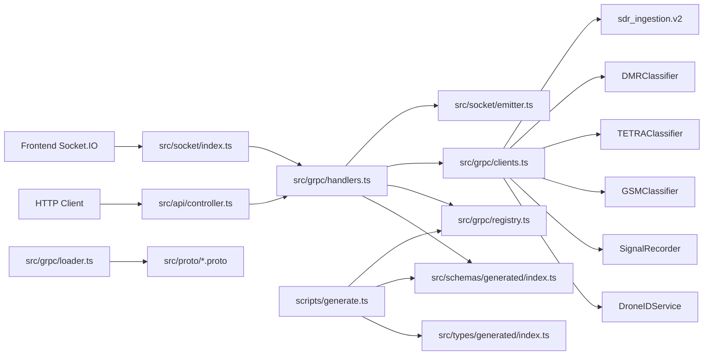
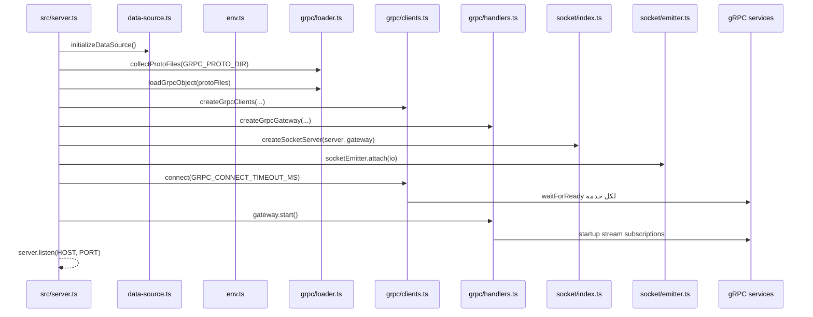
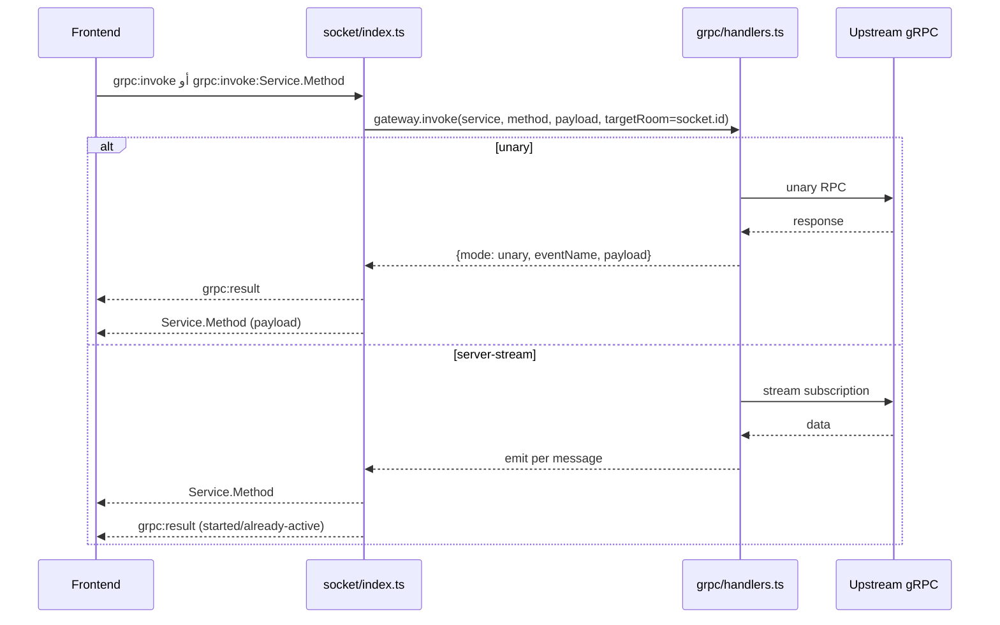
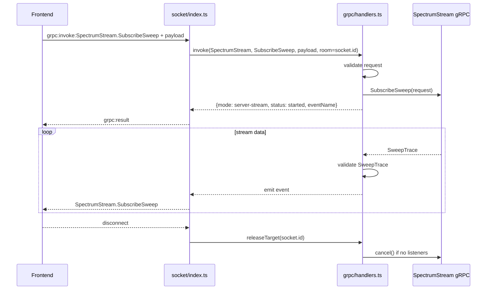
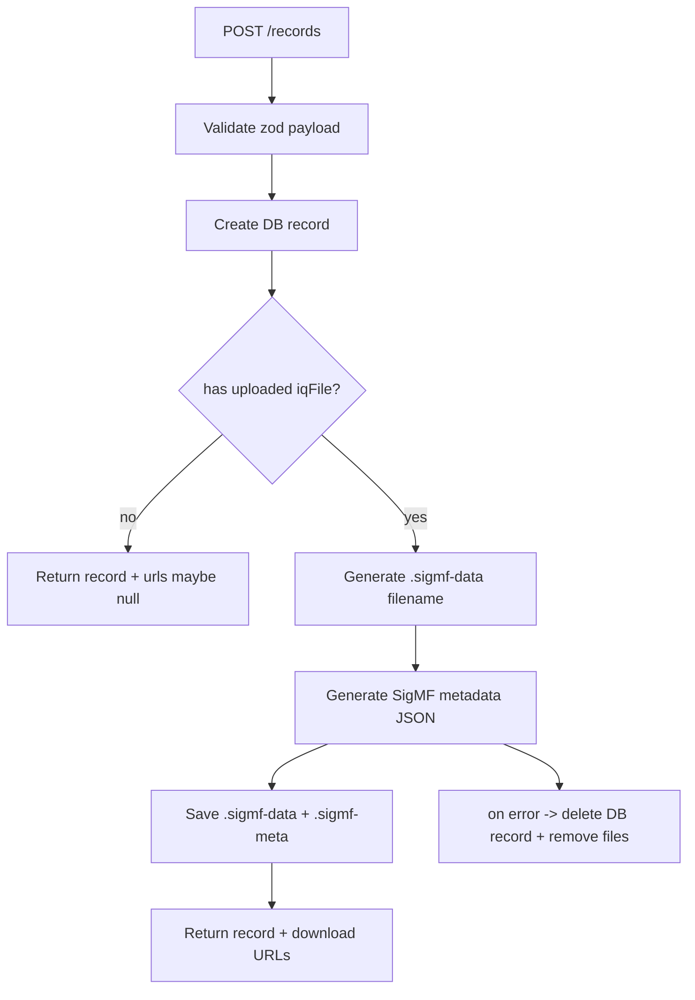
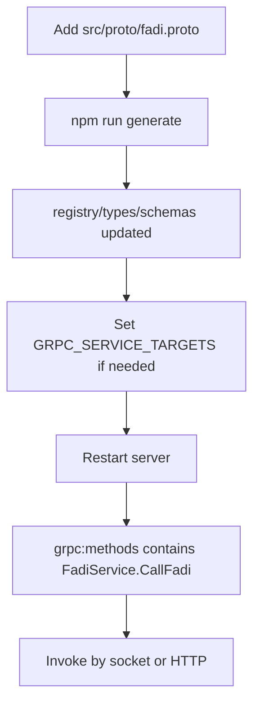

# Full Project Documents

## 1) مقدمة الوثيقة

هذه الوثيقة هي المرجع الشامل والموحّد للمشروع كاملًا. تم تصميمها بحيث إذا قرأتها من البداية للنهاية، تفهم:

- بنية المشروع الفعلية كما هي مطبقة في الكود.
- كيف يبدأ النظام عند التشغيل.
- كيف يتم تحميل وتعريف خدمات gRPC وربطها.
- كيف تتحول الطلبات من Socket.IO أو HTTP إلى gRPC.
- كيف يتم التحقق من payload قبل وبعد الاستدعاء.
- كيف يتم بث النتائج للفرونت عبر السوكت.
- كيف تعمل الـ streams وكيف يتم إدارتها وتنظيفها.
- كيف تعمل منظومة السجلات والتخزين (MySQL + SigMF files).
- كيف تضيف خدمة جديدة أو ملف proto جديد (مثال fadi/callfadi) بطريقة صحيحة بدون كسر النظام.

الوثيقة تعتمد على التنفيذ الفعلي في ملفات المشروع ضمن src و scripts و docs.

---

## 2) الصورة العامة للنظام

المشروع عبارة عن Gateway بين 3 عوالم:

1. Frontend عبر Socket.IO.
2. Backend Node.js/TypeScript (هذا المشروع).
3. خدمات gRPC متعددة (تصنيف/SDR/تسجيل/DroneID).

### الفكرة الأساسية

- الفرونت لا يستدعي gRPC مباشرة.
- الفرونت يرسل أحداث Socket (أو HTTP invoke).
- الـ Gateway يحل service/method ديناميكيًا من registry المولّد.
- يطبق validation على request و response.
- يستدعي gRPC (unary أو server-stream).
- يعيد:
  - `grpc:result` كتأكيد موحد.
  - وحدث العمل نفسه مثل `SpectrumStream.SubscribeSweep` أو `DeviceControl.OpenDevice` مع البيانات الفعلية.

### مخطط معماري عام



---

## 3) المكونات الأساسية ومسؤولية كل ملف

### الإقلاع والبنية

- `src/server.ts`
  - Bootstrap العام للتطبيق.
  - يهيّئ DB.
  - يحمّل proto files.
  - ينشئ gRPC clients/gateway/socket/emitter.
  - يجري readiness check على خدمات gRPC.
  - يشغّل startup subscriptions.

- `src/app.ts`
  - Express middlewares (helmet/cors/json/pino-http).
  - ربط REST routes.
  - 404 handler + global error handler.

- `src/config/env.ts`
  - قراءة كل env vars.
  - validation بواسطة zod.
  - parsing لـ JSON settings:
    - `GRPC_SERVICE_TARGETS`
    - `GRPC_METHOD_TIMEOUTS`
    - `GRPC_STREAM_SUBSCRIPTIONS`

### gRPC layer

- `src/grpc/loader.ts`
  - يجمع كل ملفات `.proto` بشكل recursive.
  - يحمّل packageDefinition via `@grpc/proto-loader`.

- `src/grpc/clients.ts`
  - ينشئ gRPC client لكل service من `protoRegistry.services`.
  - يحل target لكل service (override أو default).
  - readiness عبر `waitForReady`.

- `src/grpc/handlers.ts`
  - القلب الرئيسي:
  - resolve service/method.
  - validate request/response باستخدام schema registry.
  - unary invoke مع timeout.
  - server-stream start/reuse.
  - active stream tracking + release cleanup.
  - event emission عبر `SocketEmitter`.

- `src/grpc/registry.ts` (مولّد تلقائياً)
  - source of truth للخدمات والـ methods و event names.

### socket layer

- `src/socket/index.ts`
  - إنشاء Socket.IO server.
  - عند الاتصال: إرسال `grpc:methods`.
  - استقبال:
    - `grpc:invoke`
    - `grpc:invoke:Service.Method`
  - الرد:
    - `grpc:result`
    - `grpc:error`

- `src/socket/emitter.ts`
  - إرسال events لكل المستخدمين أو لغرفة محددة (`room = socket.id`).

### REST API layer

- `src/api/routes.ts` + `src/api/controller.ts`
  - endpoints:
    - `GET /health`
    - `GET /services`
    - `GET /events`
    - `POST /invoke/:service/:method`

### Records + Storage + DB

- `src/api/record-routes.ts` + `src/api/record-controller.ts`
  - إدارة signal records (إنشاء/قراءة/تحميل ملفات SigMF).

- `src/database/data-source.ts`
  - TypeORM DataSource (MySQL).

- `src/database/entities/signal-record.entity.ts`
  - تعريف جدول `signal_records`.

- `src/database/services/signal-record.service.ts`
  - CRUD للوصول للكيان.

- `src/storage/signal-record-file-storage.ts`
  - تخزين `.sigmf-data` و `.sigmf-meta` وإنشاء zip.

- `src/storage/signal-record-sigmf.ts`
  - توليد metadata SigMF من record + buffer.

### التوليد الآلي من proto

- `scripts/generate.ts`
  - يقرأ `src/proto` فقط.
  - يحدّث ملفات generated:
    - `src/grpc/registry.ts`
    - `src/types/generated/index.ts`
    - `src/schemas/generated/index.ts`

مهم جدًا: التغييرات في `src/proto` هي المصدر الحقيقي. أي تعديل فقط في مجلد proto العلوي خارج src لا يضمن انعكاسه في runtime/generation.

---

## 4) تسلسل الإقلاع الكامل



### نقاط حساسة في الإقلاع

- إذا `readyServices === 0` يتوقف الإقلاع بخطأ صريح.
- startup streams تبدأ فقط للخدمات streaming وفق القواعد التالية:
  - stream request بلا حقول: يتم تشغيله تلقائيًا.
  - stream request فيها حقول: يحتاج إدخال ضمن `GRPC_STREAM_SUBSCRIPTIONS`.

---

## 5) كيفية ربط gRPC (تفصيلي)

## 5.1 تحميل proto

`collectProtoFiles()` يمشي recursive على `env.GRPC_PROTO_DIR` ويجمع كل `.proto`.

`loadGrpcObject()` يستعمل:

- `@grpc/proto-loader.loadSync`
- ثم `grpc.loadPackageDefinition`

مع include dirs تشمل `protoDirectory` و parent dir لحل imports.

## 5.2 إنشاء clients ديناميكيًا

`createGrpcClients()` يعمل loop على `protoRegistry.services`.

لكل service:

1. resolve constructor من grpcObject حسب package path.
2. resolve target:
   - `GRPC_SERVICE_TARGETS[serviceName]` أو
   - `GRPC_SERVICE_TARGETS[fullServiceName]` أو
   - `GRPC_TARGET`.
3. إنشاء client بـ insecure أو TLS حسب `GRPC_USE_TLS`.
4. تخزين methods map بمفتاح lower-case لتسهيل resolve.

## 5.3 readiness

`connect(timeout)` ينفذ `waitForReady(deadline)` لكل خدمة بالتوازي.

- الخدمة الجاهزة تزيد `readyServices`.
- الفاشلة تزيد `failedServices` وتكتب log error.

---

## 6) آلية invoke داخل Gateway

## 6.1 resolve method

عند أي invoke:

1. `getService(serviceName)` من lookup.
2. `methods.get(methodName.toLowerCase())`.
3. إذا غير موجود:
   - service unknown => 404
   - method unknown => 404

## 6.2 Validation قبل الاستدعاء

`validateWithSchema(requestType, payload)`:

- يبحث schema داخل `schemaRegistry`.
- `safeParse` عبر zod.
- يتحقق من unknown fields عبر `collectDroppedKeys`.
- إذا وجد حقل غير معرف: 400.

## 6.3 Unary invoke

- يحدد timeout عبر:
  - `GRPC_METHOD_TIMEOUTS[Service.Method]` أو
  - default `GRPC_REQUEST_TIMEOUT_MS`.
- ينفذ callback style gRPC call داخل Promise.
- timeout => 504 GatewayError.
- أخطاء gRPC تتحول إلى HTTP-like codes:
  - INVALID_ARGUMENT / FAILED_PRECONDITION => 400
  - NOT_FOUND => 404
  - غير ذلك => 502

بعد النجاح:

- يمرر response عبر `emitValidatedMessage()`.
- emits event العمل إلى target room (socket.id) أو broadcast حسب السياق.
- يرجع كائن موحد:

```json
{
  "mode": "unary",
  "eventName": "DeviceControl.OpenDevice",
  "payload": {"...": "..."}
}
```

## 6.4 Server-stream invoke

- يتحقق request schema.
- يبني `streamKey = fullServiceName.method + stableStringify(payload)`.
- إذا stream موجود مسبقًا بنفس المفتاح:
  - يضيف targetRoom (إن وجد).
  - ويرجع `already-active`.
- إذا غير موجود:
  - يفتح stream call.
  - يسجله في `activeStreams`.
  - على كل `data`: validate response ثم emit.
  - على `error` أو `end`: يحذف stream من map.

return shape:

```json
{
  "mode": "server-stream",
  "streamKey": "...",
  "status": "started",
  "eventName": "SpectrumStream.SubscribeSweep"
}
```

## 6.5 تنظيف الاشتراكات عند disconnect

`releaseTarget(socket.id)`:

- يزيل socket room من targetRooms لكل stream.
- إذا stream ليس broadcast و targetRooms أصبحت فارغة:
  - `call.cancel()`
  - remove from activeStreams.

---

## 7) مسار Socket.IO الكامل

## 7.1 أحداث التحكم الأساسية

1. `grpc:methods` (server -> client): قائمة كل methods.
2. `grpc:result` (server -> client): نتيجة موحدة لأي invoke ناجح.
3. `grpc:error` (server -> client): نتيجة موحدة لأي invoke فاشل.
4. `grpc:invoke` (client -> server): invoke عام.
5. `grpc:invoke:Service.Method` (client -> server): invoke مباشر مخصص.

## 7.2 Sequence عام للاستدعاء عبر socket



---

## 8) توثيق جميع أحداث السوكت (الحدث + payload + response)

المبدأ العام:

- request event دائمًا:
  - `grpc:invoke:Service.Method` (أو `grpc:invoke` العام)
- response events دائمًا:
  - `grpc:result` (ack)
  - `grpc:error` (عند الفشل)
  - `Service.Method` (البيانات الفعلية عند النجاح)

## 8.1 صيغة `grpc:result`

```json
{
  "requestId": "optional",
  "triggerEvent": "grpc:invoke:Service.Method أو grpc:invoke",
  "service": "ServiceName",
  "method": "MethodName",
  "result": {
    "mode": "unary | server-stream",
    "eventName": "Service.Method",
    "payload": {},
    "streamKey": "...",
    "status": "started | already-active"
  }
}
```

## 8.2 صيغة `grpc:error`

```json
{
  "requestId": "optional",
  "triggerEvent": "grpc:invoke...",
  "service": "ServiceName",
  "method": "MethodName",
  "statusCode": 400,
  "message": "Validation failed ..."
}
```

## 8.3 جدول شامل لكل Business Event

### A) DeviceControl

1. ListDevices
- request event: `grpc:invoke:DeviceControl.ListDevices`
- payload:
```json
{}
```
- business response event: `DeviceControl.ListDevices`
- expected response: `ListDevicesResponse { devices[] }`

2. OpenDevice
- request event: `grpc:invoke:DeviceControl.OpenDevice`
- payload fields:
  - `deviceId: string`
  - `centerFreqHz: string` (uint64)
  - `sampleRateHz: number`
  - `gainMode: enum`
  - `gainTenthDb: number`
  - `freqCorrectionPpm: number`
  - `harogic?: HarogicConfig`
- business response event: `DeviceControl.OpenDevice`
- expected response: `OpenDeviceResponse { sessionId, device, sampleFormat, actualSampleRateHz }`

3. CloseDevice
- request event: `grpc:invoke:DeviceControl.CloseDevice`
- payload: `{ sessionId: string }`
- response event: `DeviceControl.CloseDevice`
- expected response: `CloseDeviceResponse {}`

4. SetFrequency
- request event: `grpc:invoke:DeviceControl.SetFrequency`
- payload: `{ sessionId: string, centerFreqHz: string }`
- response event: `DeviceControl.SetFrequency`
- expected response: `{ actualFreqHz: string }`

5. SetSampleRate
- request event: `grpc:invoke:DeviceControl.SetSampleRate`
- payload: `{ sessionId: string, sampleRateHz: number }`
- response event: `DeviceControl.SetSampleRate`
- expected response: `{ actualSampleRateHz: number }`

6. SetGain
- request event: `grpc:invoke:DeviceControl.SetGain`
- payload: `{ sessionId: string, gainMode: enum, gainTenthDb: number }`
- response event: `DeviceControl.SetGain`
- expected response: `{ actualGainTenthDb: number }`

7. SetFrequencyCorrection
- request event: `grpc:invoke:DeviceControl.SetFrequencyCorrection`
- payload: `{ sessionId: string, ppm: number }`
- response event: `DeviceControl.SetFrequencyCorrection`
- expected response: `{ actualPpm: number }`

8. GetDeviceState
- request event: `grpc:invoke:DeviceControl.GetDeviceState`
- payload: `{ sessionId: string }`
- response event: `DeviceControl.GetDeviceState`
- expected response: `GetDeviceStateResponse` (current settings + counters + capture mode + harogic config)

9. SetHarogicConfig
- request event: `grpc:invoke:DeviceControl.SetHarogicConfig`
- payload: `{ sessionId: string, config: HarogicConfig }`
- response event: `DeviceControl.SetHarogicConfig`
- expected response: `{ effective: HarogicConfig }`

10. ListSessions
- request event: `grpc:invoke:DeviceControl.ListSessions`
- payload: `{}`
- response event: `DeviceControl.ListSessions`
- expected response: `{ sessions: SessionInfo[] }`

### B) IQStream

11. Subscribe
- request event: `grpc:invoke:IQStream.Subscribe`
- payload fields:
  - `sessionId: string`
  - `chunkSizeSamples: number`
  - `dcRemovalEnabled: boolean`
  - `iqBalanceEnabled: boolean`
  - `outputFormat: enum`
- response event: `IQStream.Subscribe` (stream)
- expected stream payload: `IQChunk` per message
- `grpc:result.result.mode = server-stream`

### C) SpectrumStream

12. SubscribeRTSpectrum
- request event: `grpc:invoke:SpectrumStream.SubscribeRTSpectrum`
- payload: `{ sessionId: string, harogic?: HarogicConfig }`
- response event: `SpectrumStream.SubscribeRTSpectrum` (stream)
- expected stream payload: `SpectrumFrame`

13. SubscribeWaterfall
- request event: `grpc:invoke:SpectrumStream.SubscribeWaterfall`
- payload: `{ sessionId: string, harogic?: HarogicConfig }`
- response event: `SpectrumStream.SubscribeWaterfall` (stream)
- expected stream payload: `WaterfallTile`

14. SubscribeSweep
- request event: `grpc:invoke:SpectrumStream.SubscribeSweep`
- payload:
  - `sessionId: string`
  - `startFreqHz: string`
  - `stopFreqHz: string`
  - `harogic?: HarogicConfig`
- response event: `SpectrumStream.SubscribeSweep` (stream)
- expected stream payload: `SweepTrace`

### D) DMRClassifier

15. ClassifyFrequency
- request event: `grpc:invoke:DMRClassifier.ClassifyFrequency`
- payload:
  - `targetFreqHz: string`
  - `captureMs: number`
  - `deviceId: string`
  - `gainMode: enum`
  - `gainTenthDb: number`
- response event: `DMRClassifier.ClassifyFrequency`
- expected response: `ClassifyFrequencyResponse { verdict, isDmr, confidence, evidence, ... }`

### E) TETRAClassifier

16. ClassifyFrequency
- request event: `grpc:invoke:TETRAClassifier.ClassifyFrequency`
- payload:
  - `targetFreqHz: string`
  - `captureMs: number`
  - `deviceId: string`
  - `gainMode: enum`
  - `gainTenthDb: number`
  - `earlyExitOnFirstFrame: boolean`
  - `maxFrames: number`
- response event: `TETRAClassifier.ClassifyFrequency`
- expected response: `ClassifyFrequencyResponse { verdict, isTetra, confidence, evidence, frames[]... }`

### F) GSMClassifier

17. ClassifyFrequency
- request event: `grpc:invoke:GSMClassifier.ClassifyFrequency`
- payload:
  - `targetFreqHz: string`
  - `captureMs: number`
  - `deviceId: string`
  - `bandHint: enum`
  - `gain: number`
- response event: `GSMClassifier.ClassifyFrequency`
- expected response: `{ isGsm, snr?, signalStatus }`

18. AnalyzeCell
- request event: `grpc:invoke:GSMClassifier.AnalyzeCell`
- payload:
  - `targetFreqHz: string`
  - `gain: number`
  - `ppm: number`
  - `captureMs: number`
  - `deviceId: string`
- response event: `GSMClassifier.AnalyzeCell`
- expected response: `AnalyzeCellResponse`

19. ScanBand
- request event: `grpc:invoke:GSMClassifier.ScanBand`
- payload:
  - `band: enum`
  - `gain: number`
  - `ppm: number`
  - `pass2CaptureMs: number`
  - `deviceId: string`
  - `fcchThreshold: number`
  - `snrThreshold: number`
  - `pass1CaptureMs: number`
  - `sampleRateHz: number`
- response event: `GSMClassifier.ScanBand`
- expected response: `ScanBandResponse { cells[] ... }`

20. ScanActivity
- request event: `grpc:invoke:GSMClassifier.ScanActivity`
- payload:
  - `band: enum`
  - `gain: number`
  - `deviceId: string`
  - `speed: enum`
  - `ppm: number`
  - `targetArfcns: number[]`
- response event: `GSMClassifier.ScanActivity`
- expected response: `ScanActivityResponse`

21. CalibratePPM
- request event: `grpc:invoke:GSMClassifier.CalibratePPM`
- payload: `{ deviceId: string }`
- response event: `GSMClassifier.CalibratePPM`
- expected response: `{ smartPpm, ppmFloat, bestArfcn, status }`

### G) SignalRecorder

22. StartRecording
- request event: `grpc:invoke:SignalRecorder.StartRecording`
- payload:
  - `targetFreqHz: string`
  - `output: enum`
  - `demod: enum`
  - `durationMs: number`
  - `bandwidthHz: number`
  - `deviceId: string`
  - `sampleRateHz: number`
  - `label: string`
  - `gainTenthDb: number`
  - `gainManual: boolean`
- response event: `SignalRecorder.StartRecording`
- expected response: `StartRecordingResponse`

23. StopRecording
- request event: `grpc:invoke:SignalRecorder.StopRecording`
- payload: `{ recordingId: string }`
- response event: `SignalRecorder.StopRecording`
- expected response: `{ state }`

24. GetRecording
- request event: `grpc:invoke:SignalRecorder.GetRecording`
- payload: `{ recordingId: string }`
- response event: `SignalRecorder.GetRecording`
- expected response: `{ info: RecordingInfo }`

25. ListRecordings
- request event: `grpc:invoke:SignalRecorder.ListRecordings`
- payload:
  - `stateFilter: enum`
  - `pageSize: number`
  - `pageCursor: string`
- response event: `SignalRecorder.ListRecordings`
- expected response: `{ recordings[], nextPageCursor }`

26. DeleteRecording
- request event: `grpc:invoke:SignalRecorder.DeleteRecording`
- payload: `{ recordingId: string, stopIfRunning: boolean }`
- response event: `SignalRecorder.DeleteRecording`
- expected response: `{ deleted: boolean }`

27. WatchRecording
- request event: `grpc:invoke:SignalRecorder.WatchRecording`
- payload: `{ recordingId: string }`
- response event: `SignalRecorder.WatchRecording` (stream)
- expected stream payload: `RecordingEvent`

28. DownloadRecording
- request event: `grpc:invoke:SignalRecorder.DownloadRecording`
- payload: `{ recordingId: string, chunkSizeBytes: number }`
- response event: `SignalRecorder.DownloadRecording` (stream)
- expected stream payload: `DownloadRecordingChunk`
- ملاحظة: الـ Gateway يعمل normalize خاص لـ `DownloadRecordingChunk` لتحويل bytes إلى base64 آمن للإرسال عبر JSON.

### H) DroneIDService

29. StreamDrones
- request event: `grpc:invoke:DroneIDService.StreamDrones`
- payload:
  - `connectionType: enum`
  - `protocol: enum`
  - `antsdrIp: string`
  - `listenPort: number`
  - `zmqEndpoint: string`
  - `serialPort: string`
  - `baudRate: number`
- response event: `DroneIDService.StreamDrones` (stream)
- expected stream payload: `DronePayload` oneof

30. GetStatus
- request event: `grpc:invoke:DroneIDService.GetStatus`
- payload: `{}`
- response event: `DroneIDService.GetStatus`
- expected response: `ServiceStatus`

31. GetAntSDRStatus
- request event: `grpc:invoke:DroneIDService.GetAntSDRStatus`
- payload: `{}`
- response event: `DroneIDService.GetAntSDRStatus`
- expected response: `AntSDRStatus`

---

## 9) سيناريو startsweep المطلوب (تتبع تنفيذ حرفي)

في الكود الحالي لا يوجد method اسمه `StartSweep` داخل registry.
المكافئ التشغيلي هو:

- `SpectrumStream.SubscribeSweep`

إذا أراد الفرونت تنفيذ "start sweep" فعليًا، يرسل:

```json
{
  "event": "grpc:invoke:SpectrumStream.SubscribeSweep",
  "payload": {
    "sessionId": "session-123",
    "startFreqHz": "2400000000",
    "stopFreqHz": "2500000000"
  },
  "requestId": "swp-001"
}
```

### مسار التنفيذ من أين إلى أين

1. العميل يرسل `grpc:invoke:SpectrumStream.SubscribeSweep`.
2. `src/socket/index.ts` يلتقط الحدث عبر handler المباشر لكل method.
3. `normalizeMethodInvokeRequest()` يوحّد payload/requestId.
4. `handleInvoke()` ينادي:
   - `gateway.invoke("SpectrumStream", "SubscribeSweep", payload, { targetRoom: socket.id })`
5. `src/grpc/handlers.ts`:
   - `resolveMethod` يتأكد الخدمة/الطريقة موجودة.
   - `isServerStreamMethod` => true.
   - `startServerStream(...)` يبدأ الاشتراك.
6. `startServerStream`:
   - validate request بواسطة schema `sdr_ingestion.v2.SubscribeSweepRequest`.
   - يبني streamKey مستقر.
   - إذا stream موجود بنفس payload => يرجع `already-active`.
   - إذا جديد => يفتح call إلى `(service.client as any)[method.clientMethodName](parsedPayload)`.
7. السيرفر يرد فورًا على العميل:
   - `grpc:result` مع `mode=server-stream` و `status=started`.
8. مع كل رسالة data من gRPC:
   - `emitValidatedMessage` يتحقق من schema `sdr_ingestion.v2.SweepTrace`.
   - `SocketEmitter.emit("SpectrumStream.SubscribeSweep", validatedPayload, { room: socket.id })`.
9. العميل يستقبل stream frames على `SpectrumStream.SubscribeSweep`.
10. عند disconnect:
    - `gateway.releaseTarget(socket.id)` يزيل اشتراكه.
    - إذا لم يبق مستمعون لهذا stream يتم `call.cancel()` وإغلاقه.

### مخطط تزامن startsweep



---

## 10) كيف يرسل الفرونت payload بشكل صحيح

## 10.1 قواعد مهمة جدًا

1. استخدم camelCase (وليس snake_case) لأن `keepCase: false` في proto-loader.
2. حقول `int64/uint64` الأفضل تمريرها كسلاسل نصية string.
3. لا ترسل حقول إضافية غير معرفة في proto:
   - سيتم رفضها بسبب `collectDroppedKeys` و GatewayError 400.
4. في stream methods:
   - `grpc:result` لا يحتوي stream data نفسها.
   - data تأتي لاحقًا على event العمل نفسه.

## 10.2 مثال invoke عام

```json
{
  "service": "DeviceControl",
  "method": "ListDevices",
  "payload": {},
  "requestId": "req-001"
}
```

## 10.3 مثال invoke مباشر

```json
{
  "payload": {
    "sessionId": "session-123"
  },
  "requestId": "req-002"
}
```

يرسل على event:

`grpc:invoke:DeviceControl.GetDeviceState`

---

## 11) REST API المكافئة

المشروع يوفر نفس gateway عبر HTTP:

- `GET /health`
- `GET /services`
- `GET /events`
- `POST /invoke/:service/:method`

مثال:

```http
POST /invoke/DeviceControl/ListDevices
Content-Type: application/json

{}
```

النتيجة تكون نفس منطق `gateway.invoke`.

---

## 12) تتبع التخزين والسجلات (records) بالتفصيل

هذا المسار منفصل عن socket gateway لكنه جزء مهم بالمشروع.

## 12.1 إنشاء سجل جديد

`POST /records` (multipart أو JSON).

إذا يوجد ملف `iqFile` مرفوع:

1. إنشاء UUID (أو استخدام uuid القادم من الطلب).
2. إنشاء اسم ملف SigMF data عبر:
   - `createDataFileName(uuid, originalname)`
3. حفظ record في DB عبر `signal-record.service.create`.
4. توليد metadata SigMF عبر `createSigmfMetadata(record, dataFileName, buffer)`.
5. حفظ `.sigmf-data` و `.sigmf-meta` على disk.
6. إرجاع روابط تنزيل الملفات.

إذا فشل حفظ الملفات بعد إنشاء record:

- يتم rollback يدوي:
  - delete record من DB
  - remove files إن وجدت

## 12.2 تنزيلات السجلات

- `/records/:uuid/iq-file`
- `/records/:uuid/sigmf-data`
- `/records/:uuid/sigmf-meta`
- `/records/:uuid/sigmf` (zip archive)

يتم أولًا التحقق:

- record موجود؟
- iqFile موجود؟
- data/meta files موجودة فعليًا؟

ثم الإرسال.

### مخطط flow للسجلات



---

## 13) الأخطاء وطرق المعالجة

## 13.1 مصادر الأخطاء

1. Socket payload ليس object.
2. عدم وجود service/method.
3. schema validation fail.
4. unknown payload fields.
5. gRPC upstream errors.
6. gRPC timeout.
7. stream errors/end.

## 13.2 شكل الأخطاء للعميل

- عبر socket: `grpc:error`.
- عبر HTTP: status code + `{ message }`.

## 13.3 Mapping تقريبي للأخطاء

- INVALID_ARGUMENT / FAILED_PRECONDITION => 400
- NOT_FOUND => 404
- timeout داخلي => 504
- غير ذلك غالبًا => 502 أو 500

---

## 14) إضافة خدمة جديدة أو proto جديد: مثال fadi/callfadi

الهدف:

- إضافة ملف proto اسمه `fadi.proto` ضمن `src/proto`.
- يحتوي service `FadiService` و method `CallFadi`.
- يصبح callable تلقائيًا عبر socket و HTTP بدون تعديل يدوي على socket routes.

## 14.1 مثال proto

أنشئ `src/proto/fadi.proto`:

```proto
syntax = "proto3";
package fadi.v1;

service FadiService {
  rpc CallFadi (CallFadiRequest) returns (CallFadiResponse);
}

message CallFadiRequest {
  string text = 1;
  uint64 request_ts = 2;
}

message CallFadiResponse {
  bool ok = 1;
  string message = 2;
}
```

## 14.2 ماذا تعدّل في الكود؟

غالبًا لا تحتاج تعديل يدوي مباشر في core files لأن التصميم ديناميكي.

الخطوات الصحيحة:

1. أضف proto في `src/proto/fadi.proto`.
2. شغّل:
   - `npm run generate`
3. سيتحدّث تلقائيًا:
   - `src/grpc/registry.ts`
   - `src/types/generated/index.ts`
   - `src/schemas/generated/index.ts`
4. تأكد أن upstream gRPC server الحقيقي يعرّف نفس service/method.
5. أضف target في `.env` إذا الخدمة على بورت خاص:
   - ضمن `GRPC_SERVICE_TARGETS`:

```json
{
  "FadiService": "127.0.0.1:5099"
}
```

6. أعد تشغيل السيرفر.
7. عند اتصال socket client ستجد تلقائيًا في `grpc:methods`:
   - `grpc:invoke:FadiService.CallFadi`
8. استدعاؤها مباشرة:

```json
{
  "payload": {
    "text": "hello",
    "requestTs": "1710000000000"
  },
  "requestId": "fadi-1"
}
```

على event:

`grpc:invoke:FadiService.CallFadi`

## 14.3 هل نحتاج تعديل socket/index.ts؟

لا، لأنه يبني methods ديناميكيًا من `gateway.getServices()`.

## 14.4 هل نحتاج تعديل api/routes.ts؟

لا، endpoint invoke عام:

`POST /invoke/FadiService/CallFadi`

## 14.5 متى تحتاج تعديل إضافي؟

1. إذا method streaming وتريد startup auto-subscription بpayload:
- أضف إعداد في `GRPC_STREAM_SUBSCRIPTIONS`.

2. إذا تحتاج timeout خاص:
- أضف `FadiService.CallFadi` في `GRPC_METHOD_TIMEOUTS`.

3. إذا payload فيه fields معقدة أو oneof:
- راقب schema generated لضبط شكل JSON الصحيح.

### مخطط إضافة proto جديد



---

## 15) مثال end-to-end حقيقي: فتح جهاز ثم بدء sweep

## 15.1 ListDevices

- أرسل: `grpc:invoke:DeviceControl.ListDevices` مع `{}`.
- استقبل:
  - `grpc:result`
  - `DeviceControl.ListDevices` وفيه `devices[]`.

## 15.2 OpenDevice

- أرسل: `grpc:invoke:DeviceControl.OpenDevice` ببيانات الجهاز.
- استقبل:
  - `grpc:result`
  - `DeviceControl.OpenDevice` وفيه `sessionId`.

## 15.3 SubscribeSweep (start sweep)

- أرسل: `grpc:invoke:SpectrumStream.SubscribeSweep` مع:

```json
{
  "sessionId": "session-from-open-device",
  "startFreqHz": "2400000000",
  "stopFreqHz": "2500000000"
}
```

- استقبل:
  - `grpc:result` (started/already-active)
  - stream مستمر على `SpectrumStream.SubscribeSweep`.

---

## 16) startup streams من env

`GRPC_STREAM_SUBSCRIPTIONS` هي قائمة JSON.

مثال:

```json
[
  {
    "service": "DroneIDService",
    "method": "StreamDrones",
    "payload": {
      "connectionType": "CONNECTION_ETHERNET",
      "protocol": "PROTOCOL_DJI"
    }
  }
]
```

عند `gateway.start()` يتم تشغيلها كمصدر `startup` وبالتالي broadcast.

مهم:

- startup stream broadcast لكل العملاء.
- streams الناتجة عن طلب عميل (api/socket invoke) تكون غالبًا scoped لذلك العميل (room = socket.id).

---

## 17) ملاحظات هندسية تمنع المشاكل

1. لا تضف proto في مكان غير `src/proto` إذا أردت generation/runtime صحيح.
2. بعد أي تعديل proto: شغّل `npm run generate` ثم `npm run typecheck`.
3. راقب camelCase دائمًا في payload.
4. تجنب إرسال extra keys لأن validation سيرفضها.
5. استخدم `requestId` دائمًا في الفرونت لتتبع ack.
6. في streaming methods: listener على business event إلزامي وليس `grpc:result` فقط.
7. عند disconnect العميل، تأكد الفرونت لا يفترض استمرار stream إلا بعد إعادة الاشتراك.

---

## 18) Checklists تنفيذية

## 18.1 Checklist إضافة خدمة جديدة

1. إضافة/تعديل proto في `src/proto`.
2. `npm run generate`.
3. التحقق من ظهور الخدمة في `src/grpc/registry.ts`.
4. إضافة target إلى `GRPC_SERVICE_TARGETS` إن لزم.
5. إعادة تشغيل السيرفر.
6. اختبار `GET /services` والتأكد ظهور method.
7. اختبار socket event من `grpc:invoke:Service.Method`.
8. مراقبة `grpc:result` وbusiness event.

## 18.2 Checklist إضافة method stream جديدة

1. تأكد request/response schema يتولدان.
2. اختبر invoke أول مرة (status started).
3. اختبر invoke ثاني مرة بنفس payload (status already-active).
4. اختبر disconnect => releaseTarget cleanup.
5. اختبر reconnect + re-subscribe من الفرونت.

---

## 19) ملخص عملي نهائي

إذا أردت فهم المشروع بسرعة تشغيلية دقيقة:

1. ابدأ من `src/server.ts` لتفهم bootstrap.
2. ثم `src/socket/index.ts` لفهم contract مع الفرونت.
3. ثم `src/grpc/handlers.ts` لأنه مركز المنطق الحقيقي.
4. راجع `src/grpc/registry.ts` لمعرفة كل الأحداث/الخدمات المتاحة الآن.
5. راجع `src/proto/*.proto` لفهم payload الحقيقي لكل method.
6. عند إضافة proto جديد (مثل fadi): عدّل `src/proto` ثم `npm run generate` ثم اضبط env.

بهذا التسلسل يمكنك تنفيذ أي توسعة جديدة بثقة: خدمة جديدة، method جديدة، stream جديدة، أو سيناريو تشغيل جديد للفرونت.

---

## 20) مقتطفات كود حقيقية من المشروع (مرجعية)

هذا القسم يضع مقتطفات فعلية من الكود لتثبيت الفهم التنفيذي.

## 20.1 من `src/socket/index.ts` (الرد الموحد عبر `grpc:result`)

```ts
const handleInvoke = async ({ service, method, payload, requestId }: SocketInvokeRequest, triggerEvent: string) => {
  try {
    const result = await gateway.invoke(service, method, payload ?? {}, { targetRoom: socket.id });

    socket.emit(SOCKET_RESULT_EVENT, {
      requestId,
      triggerEvent,
      service,
      method,
      result
    });
  } catch (error) {
    const statusCode = error instanceof GatewayError ? error.statusCode : 500;
    const message = error instanceof Error ? error.message : 'Unknown socket invocation error';

    socket.emit(SOCKET_ERROR_EVENT, {
      requestId,
      triggerEvent,
      service,
      method,
      statusCode,
      message
    });
  }
};
```

المعنى التنفيذي:

- كل استدعاء يمر عبر `gateway.invoke`.
- النجاح يرجع `grpc:result`.
- الفشل يرجع `grpc:error` مع statusCode/message موحدين.

## 20.2 من `src/grpc/handlers.ts` (تمييز unary vs stream)

```ts
if (isUnaryMethod(method)) {
  const parsedPayload = validateWithSchema(method.definition.requestType, payload, logger);
  const timeoutMs = resolveRequestTimeoutMs(
    service.definition.serviceName,
    service.definition.fullServiceName,
    method.definition.methodName,
  );

  const response = await new Promise<unknown>((resolve, reject) => {
    const timeout = setTimeout(() => {
      reject(new GatewayError(`gRPC request timed out for ${service.definition.serviceName}.${method.definition.methodName}`, 504));
    }, timeoutMs);

    (service.client as any)[method.clientMethodName](parsedPayload, (error: ServiceError | null, result: unknown) => {
      clearTimeout(timeout);
      if (error) {
        reject(error);
        return;
      }
      resolve(result);
    });
  });

  const emittedPayload = emitValidatedMessage(service, method, response, {
    broadcast: !options?.targetRoom,
    targetRooms: new Set(options?.targetRoom ? [options.targetRoom] : [])
  });

  return {
    mode: 'unary',
    eventName: method.definition.eventName,
    payload: emittedPayload
  };
}

if (isServerStreamMethod(method)) {
  const started = startServerStream(service, method, payload, 'api', options?.targetRoom);

  return {
    mode: 'server-stream',
    ...started
  };
}
```

المعنى التنفيذي:

- الـ Gateway يفرق صراحةً بين unary و server-stream.
- unary ينتظر response واحدة، stream يبدأ اشتراك مستمر.

## 20.3 من `scripts/generate.ts` (كيف تُولد registry/events تلقائيًا)

```ts
const protoDirectory = path.resolve(projectRoot, 'src/proto');
const typesOutputFile = path.resolve(projectRoot, 'src/types/generated/index.ts');
const schemasOutputFile = path.resolve(projectRoot, 'src/schemas/generated/index.ts');
const registryOutputFile = path.resolve(projectRoot, 'src/grpc/registry.ts');

const protoFiles = walkDirectory(protoDirectory).sort();
const root = readProtoRoot(protoFiles);
const { enums, messages, services, symbolMap } = collectDefinitions(root);

fs.writeFileSync(typesOutputFile, renderTypesFile(enums, messages, symbolMap), 'utf8');
fs.writeFileSync(schemasOutputFile, renderSchemasFile(enums, messages, symbolMap), 'utf8');
fs.writeFileSync(registryOutputFile, renderRegistryFile(protoFiles, services), 'utf8');
```

المعنى التنفيذي:

- أي proto جديد داخل `src/proto` ينعكس تلقائياً في:
  - types
  - schemas
  - registry/events

## 20.4 من `src/grpc/handlers.ts` (منع الحقول غير المعرفة)

```ts
const droppedKeys = collectDroppedKeys(payload, result.data);

if (droppedKeys.length > 0) {
  throw new GatewayError(`Unknown field(s) for ${typeName}: ${droppedKeys.join(', ')}`, 400);
}
```

المعنى التنفيذي:

- حتى لو الـ payload "قريب" من الصحيح، أي key زائد يتم رفضه.
- هذا يعطي contract صارم وواضح بين الفرونت والباك.

## 20.5 مثال payloads واقعية مختصرة

1. OpenDevice

```json
{
  "payload": {
    "deviceId": "rtl-0",
    "centerFreqHz": "403475000",
    "sampleRateHz": 2048000,
    "gainMode": "GAIN_MODE_MANUAL",
    "gainTenthDb": 200,
    "freqCorrectionPpm": 0
  },
  "requestId": "open-001"
}
```

2. SubscribeRTSpectrum

```json
{
  "payload": {
    "sessionId": "session-abc-123"
  },
  "requestId": "rt-001"
}
```

3. DroneID StreamDrones

```json
{
  "payload": {
    "connectionType": "CONNECTION_ETHERNET",
    "protocol": "PROTOCOL_DJI",
    "antsdrIp": "172.31.100.2",
    "listenPort": 52002,
    "zmqEndpoint": "tcp://127.0.0.1:4221"
  },
  "requestId": "drone-001"
}
```

---

## 21) خريطة الرجوع إلى ملفات docs الأصلية

هذه الوثيقة موحدة، لكن إن أردت تعمقًا إضافيًا حسب المجال:

- `docs/socket-events.md`: عقد الأحداث والتعامل من منظور الفرونت.
- `docs/runtime-workflow-deep-ar.md`: شرح مسار التنفيذ الداخلي المفصل.
- `docs/DroneID-Service-AR.md`: تفاصيل DroneID domain.
- `docs/IQ-File-Storage-Analysis-AR.md`: تفاصيل تخزين IQ/SigMF.
- `docs/Storage-Diagnostic-Tools-AR.md`: أدوات التشخيص والتتبع.

بهذا تكون `Full Project Documents` بوابة الفهم الموحدة، والملفات أعلاه مراجع تخصصية داعمة.
