# التوثيق التشغيلي العميق للمشروع

هذا الملف يشرح مسار العمل الداخلي للمشروع خطوة بخطوة، من لحظة تشغيل السيرفر وحتى لحظة وصول الطلب من الفرونت وعودته بالنتيجة أو بدء الستريم.

الهدف من هذا الملف ليس فقط ذكر أسماء الأحداث، بل شرح:

- ما الذي يرسله الفرونت
- أي جزء من كود الباك يعمل أولاً
- كيف يتم حل اسم الخدمة والـ method
- أين تتم validation
- كيف يتم استدعاء gRPC
- كيف تعود النتيجة إلى الفرونت
- كيف يتم تنظيف الاشتراكات عند انقطاع العميل

هذا الملف مكمل لملف `docs/socket-events.md`:

- `socket-events.md` يشرح عقد الأحداث والـ payloads
- هذا الملف يشرح المسار التنفيذي الداخلي داخل الكود

---

## 1) الصورة العامة للمشروع

المشروع هو بوابة وسيطة بين 3 أطراف:

1. الفرونت عبر Socket.IO
2. الباك Node.js/TypeScript الحالي
3. خدمات gRPC الخلفية

الفكرة الأساسية:

- الفرونت لا يتعامل مباشرة مع gRPC
- الفرونت يرسل أحداث Socket.IO إلى هذا الباك
- هذا الباك يحوّل الطلب إلى gRPC
- ثم يعيد النتيجة إلى الفرونت على شكل أحداث Socket.IO منظمة

### المكونات الرئيسية

- `src/server.ts`
  نقطة الإقلاع العامة للمشروع

- `src/grpc/loader.ts`
  يجمع ملفات proto ويحمّلها إلى كائن gRPC قابل للاستخدام

- `src/grpc/clients.ts`
  ينشئ gRPC clients لكل service ويحدد لكل خدمة الـ target المناسب

- `src/grpc/handlers.ts`
  هذا هو القلب الحقيقي للمشروع
  هنا تتم:
  - معرفة أي خدمة وأي method سيتم استدعاؤها
  - validation للطلبات والردود
  - التفريق بين unary و server-stream
  - إدارة الـ active streams
  - بث الردود إلى العميل المناسب

- `src/socket/index.ts`
  يربط Socket.IO مع `GrpcGateway`
  وهنا يتم استقبال `grpc:invoke` و `grpc:invoke:Service.Method`

- `src/socket/emitter.ts`
  المسؤول عن إرسال أحداث العمل من الباك إلى العميل أو إلى جميع العملاء

- `src/api/routes.ts` و `src/api/controller.ts`
  يوفّران مسار HTTP بديل لاستدعاء نفس الـ gateway عبر REST

---

## 2) مخطط البنية العامة

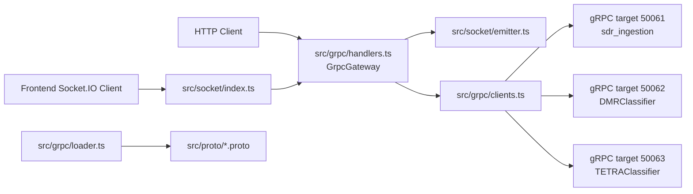

---

## 3) مسار الإقلاع Startup

### ماذا يحدث عند تشغيل السيرفر

المسار يبدأ من `src/server.ts` داخل الدالة `bootstrap()`:

1. يتم قراءة إعدادات البيئة من `src/config/env.ts`
2. يتم جمع جميع ملفات proto من `env.GRPC_PROTO_DIR` عبر `collectProtoFiles()`
3. يتم تحميلها إلى كائن gRPC عبر `loadGrpcObject()`
4. يتم إنشاء client لكل service عبر `createGrpcClients()`
5. يتم إنشاء `SocketEmitter`
6. يتم إنشاء `GrpcGateway`
7. يتم إنشاء Express app ثم HTTP server
8. يتم إنشاء Socket.IO server عبر `createSocketServer()`
9. يتم ربط الـ emitter مع Socket.IO عبر `socketEmitter.attach(io)`
10. يتم تنفيذ readiness check لكل gRPC service عبر `grpcClients.connect()`
11. إذا لم تصبح أي خدمة جاهزة يتم إيقاف الإقلاع بالكامل
12. يتم تشغيل `gateway.start()` لبدء أي startup streams معرفة في البيئة
13. يبدأ HTTP/Socket server في الاستماع

### مخطط الإقلاع

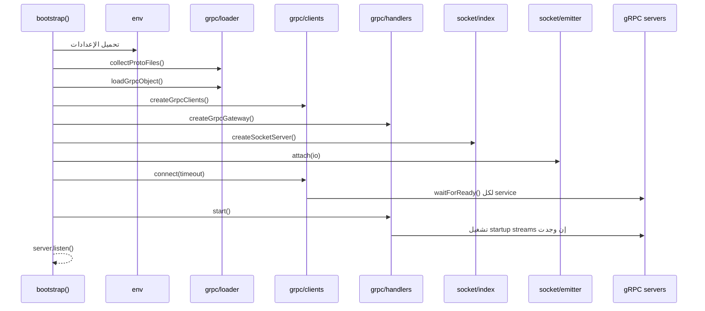

---

## 4) كيف تُحدد الخدمة والبورت المناسب

المنطق موجود في `src/grpc/clients.ts` داخل `createGrpcClients()`.

لكل service من `protoRegistry.services`:

1. يتم إيجاد constructor الخاص بها داخل كائن gRPC المحمّل
2. يتم تحديد الـ target هكذا:
   - إذا وُجدت قيمة في `GRPC_SERVICE_TARGETS` باسم `serviceName` تستخدم هذه القيمة
   - أو إذا وُجدت باسم `fullServiceName` تستخدم هذه القيمة
   - وإلا يستخدم `GRPC_TARGET` الافتراضي
3. يتم إنشاء `new ServiceClient(serviceTarget, credentials)`

### الوضع الحالي للأهداف

- `sdr_ingestion.*` يذهب افتراضياً إلى `GRPC_TARGET` على `50061`
- `DMRClassifier` يذهب إلى `50062`
- `TETRAClassifier` يذهب إلى `50063`

هذا مهم جداً لأن الباك هنا لا يرسل كل الخدمات إلى نفس الخادم بالضرورة.

---

## 5) كيف يتعامل السيرفر مع اتصال Socket.IO

المنطق موجود في `src/socket/index.ts` داخل:

- `createSocketServer()`
- callback الخاص بـ `io.on('connection', ...)`

### ما الذي يحدث عند اتصال عميل جديد

1. يسجل Log أن عميل socket اتصل
2. يستدعي `gateway.getServices()`
3. يبني قائمة `methods`
4. لكل method يبني:
   - `requestEvent = grpc:invoke:Service.Method`
   - `responseEvent = Service.Method`
5. يرسل مباشرة إلى العميل الحدث `grpc:methods`

### مخطط اتصال عميل جديد

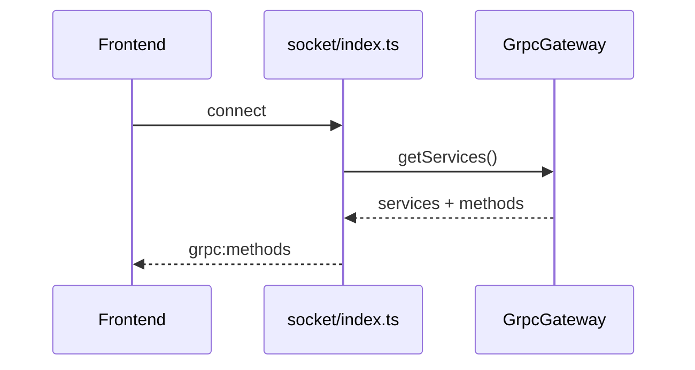

---

## 6) نمطا الاستدعاء من الفرونت

الباك يدعم نمطين متكافئين من الفرونت:

### النمط الأول: `grpc:invoke`

يرسل الفرونت حدثاً عاماً هكذا:

```json
{
  "service": "DeviceControl",
  "method": "OpenDevice",
  "payload": {
    "deviceId": "rtlsdr:2"
  },
  "requestId": "req-1"
}
```

### النمط الثاني: `grpc:invoke:Service.Method`

مثال:

```text
grpc:invoke:DeviceControl.OpenDevice
```

ومعه payload مباشر أو مغلف داخل `payload`.

### ماذا يفعل الباك مع هذين النمطين

- في الحالتين ينتهي الأمر إلى نفس الدالة الداخلية `handleInvoke()` داخل `src/socket/index.ts`
- الاختلاف فقط في طريقة استخراج `service` و `method` و `requestId`

---

## 7) التتبع التنفيذي العام لأي Unary Request

هذا هو أهم مسار في المشروع.

### التتبع خطوة بخطوة

افترض أن الفرونت أرسل:

```text
grpc:invoke:DeviceControl.OpenDevice
```

أو:

```json
{
  "service": "DeviceControl",
  "method": "OpenDevice",
  "payload": {...}
}
```

### الخطوات داخل الباك

1. `src/socket/index.ts`
   `socket.on(...)` يلتقط الحدث

2. إذا كان الحدث عاماً `grpc:invoke`
   يتم التحقق أن `service` و `method` موجودان ومن نوع string

3. إذا كان الحدث مباشراً `grpc:invoke:Service.Method`
   يتم تمرير الرسالة عبر `normalizeMethodInvokeRequest()`

4. في الحالتين يتم استدعاء `handleInvoke()`

5. `handleInvoke()` ينادي:

   ```ts
   gateway.invoke(service, method, payload ?? {}, { targetRoom: socket.id })
   ```

6. داخل `src/grpc/handlers.ts`:
   `invoke()` يعمل `resolveMethod(serviceName, methodName)`

7. `resolveMethod()`:
   - يبحث عن service عبر `clients.getService()`
   - يبحث عن method عبر `service.methods.get(methodName.toLowerCase())`
   - إذا لم يجد الخدمة أو الميثود يرمي `GatewayError(404)`

8. إذا كان method من نوع unary:
   - يتم التحقق من الـ payload عبر `validateWithSchema(requestType, payload, logger)`
   - إذا فشلت validation يرجع `400`

9. يتم تحديد المهلة عبر `resolveRequestTimeoutMs()`
   - إما من `GRPC_METHOD_TIMEOUTS`
   - أو من `GRPC_REQUEST_TIMEOUT_MS`

10. يتم استدعاء gRPC client الفعلي:

    ```ts
    (service.client as any)[method.clientMethodName](parsedPayload, callback)
    ```

11. إذا فشل gRPC:
    - يتم تحويل الخطأ إلى `GatewayError`
    - ثم يعود إلى `handleInvoke()`
    - ثم يرسل الباك `grpc:error`

12. إذا نجح gRPC:
    - يتم تمرير response عبر `emitValidatedMessage()`
    - هذه الدالة تتحقق من response schema
    - ثم ترسل event العمل الحقيقي عبر `SocketEmitter`

13. لأن `targetRoom = socket.id` في استدعاءات socket:
    - يرسل الباك event العمل إلى نفس العميل فقط
    - مثال: `DeviceControl.OpenDevice`

14. بعد ذلك يعود `gateway.invoke()` بقيمة منظمة:

    ```json
    {
      "mode": "unary",
      "eventName": "DeviceControl.OpenDevice",
      "payload": {...}
    }
    ```

15. `handleInvoke()` يرسل بعدها `grpc:result` إلى نفس العميل

### مخطط تدفق Unary Request

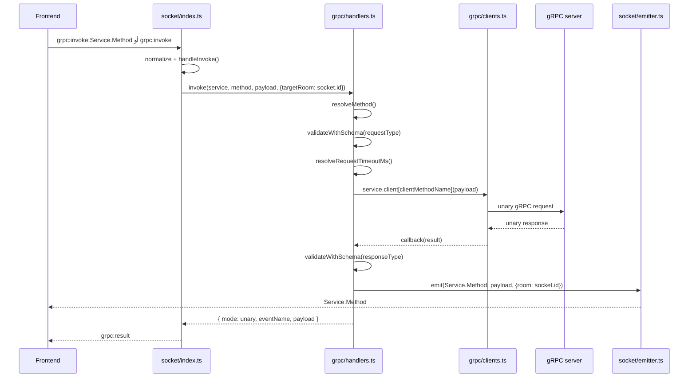

### مخطط الحالات لـ Unary Request

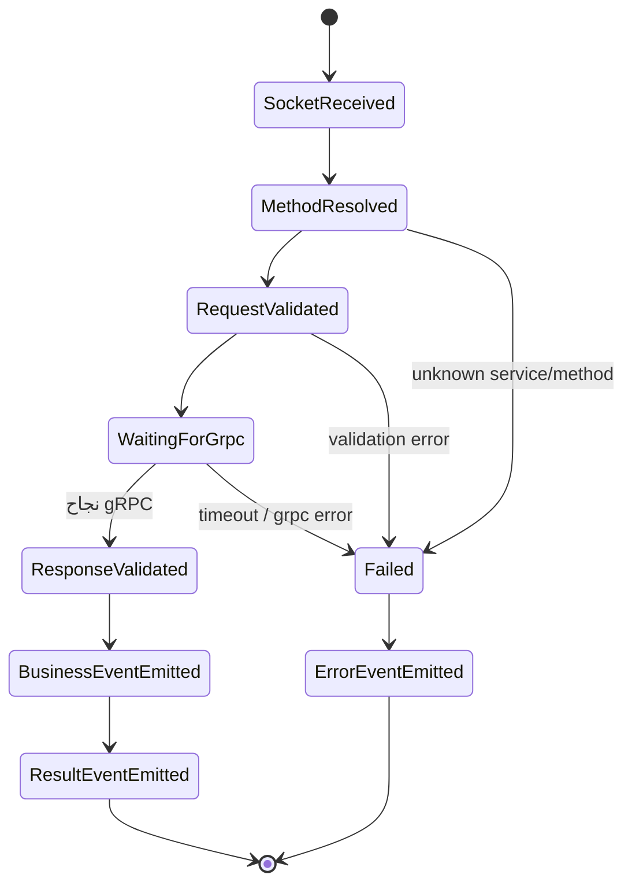

---

## 8) التتبع التنفيذي العام لأي Streaming Request

هذا يخص:

- `IQStream.Subscribe`
- `SpectrumStream.SubscribeRTSpectrum`
- `SpectrumStream.SubscribeWaterfall`
- `SpectrumStream.SubscribeSweep`

### الفرق الجوهري عن unary

- لا يوجد response واحد نهائي فقط
- يوجد stream طويل قد ينتج عدداً كبيراً من الرسائل
- الباك يحتفظ به داخل `activeStreams`

### الخطوات

1. يصل الحدث من الفرونت إلى `handleInvoke()`
2. ينادي `gateway.invoke(..., { targetRoom: socket.id })`
3. `invoke()` يكتشف أن method من نوع server-stream
4. ينادي `startServerStream()`
5. `startServerStream()`:
   - يعمل validation للطلب
   - يبني `streamKey`
   - يبحث إذا كان stream نفسه موجوداً مسبقاً

### إذا كان stream موجوداً مسبقاً

- لا ينشئ stream جديداً
- يضيف العميل الحالي إلى `targetRooms`
- يعيد:

```json
{
  "mode": "server-stream",
  "status": "already-active"
}
```

### إذا لم يكن موجوداً

1. ينشئ gRPC stream
2. يخزن metadata داخل `activeStreams`
3. يربط listeners:
   - `call.on('data')`
   - `call.on('error')`
   - `call.on('end')`
4. يعيد `status: started`

### عند وصول كل message من gRPC stream

1. يتم استدعاء `emitValidatedMessage()`
2. يتم التحقق من response schema
3. يرسل `SocketEmitter` event العمل إلى كل room مشترك في هذا stream

### ما الذي يرجع فوراً للفرونت

يرجع `grpc:result` كـ acknowledgment فقط، وليس data payload النهائي.

### مخطط تدفق Streaming Request

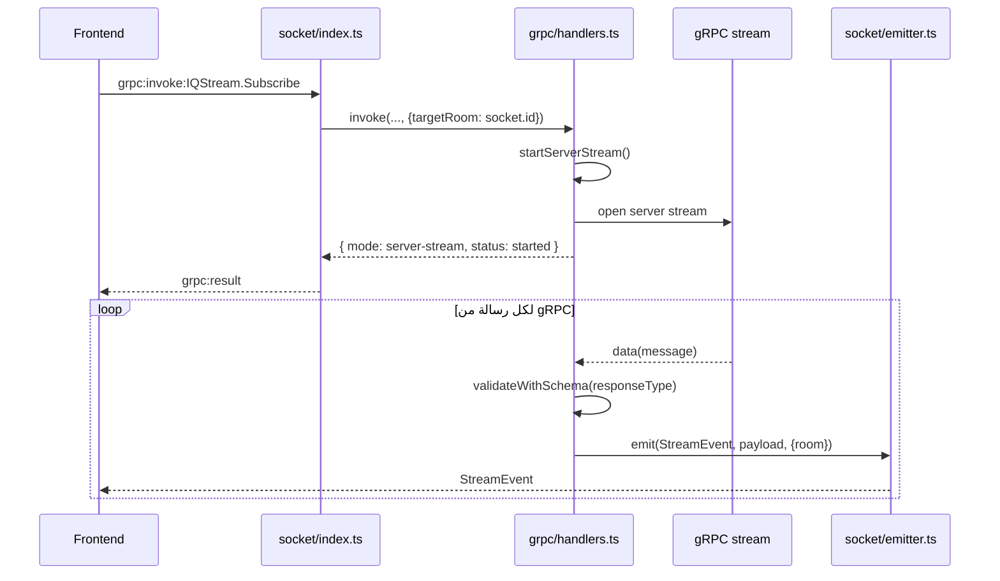

### مخطط الحالات لـ Streaming Request

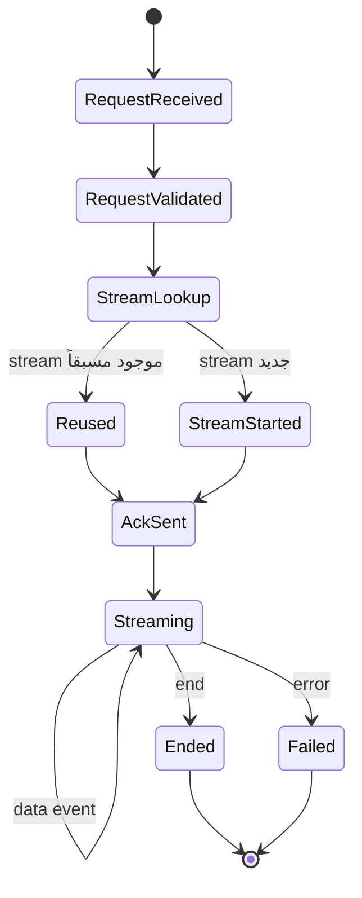

---

## 8.1) مثال متكامل رقم 1: `DeviceControl.ListDevices`

هذا المثال يشرح أبسط طلب unary فعلي من لحظة تشغيل النظام وحتى لحظة وصول قائمة الأجهزة إلى الفرونت.

### قبل أن يرسل الفرونت أي شيء

1. عند الإقلاع داخل `src/server.ts` يتم استدعاء:

   ```ts
   const grpcClients = createGrpcClients(...)
   ```

2. داخل `src/grpc/clients.ts` تنشأ جميع gRPC clients مرة واحدة أثناء الإقلاع، وليس عند كل event من السوكت.

3. بالنسبة لخدمة `DeviceControl`:
   - يتم أخذ تعريفها من `protoRegistry.services`
   - يتم إيجاد constructor من الـ proto المحمّل
   - يتم إنشاء client فعلي هكذا تقريباً:

   ```ts
   const client = new ServiceClient(serviceTarget, credentials)
   ```

4. هذا الـ client يُخزَّن داخل `GatewayClients.services` ويصبح جاهزاً لإعادة الاستخدام لاحقاً.

5. بعد ذلك ينفذ السيرفر:

   ```ts
   await grpcClients.connect(...)
   ```

6. هنا فقط يتم عمل `waitForReady()` لكل خدمة للتأكد أن upstream gRPC جاهز قبل استقبال الطلبات الحقيقية.

### ماذا يحدث عندما يتصل الفرونت أول مرة

1. `src/socket/index.ts`
   داخل `io.on('connection', (socket) => { ... })`
   يتم التقاط اتصال العميل.

2. ينادي السيرفر `gateway.getServices()`.

3. من هذه البيانات يبني قائمة methods ومنها:
   - `requestEvent = grpc:invoke:DeviceControl.ListDevices`
   - `responseEvent = DeviceControl.ListDevices`

4. يرسل السيرفر مباشرة:

   ```text
   grpc:methods
   ```

5. هنا يعرف الفرونت أن لديه method اسمها `DeviceControl.ListDevices` وأنها unary وليست stream.

### Payload نموذجي من الفرونت

بما أن `ListDevicesRequest` فارغ في الـ proto، فيمكن أن يرسل الفرونت:

```json
{
  "requestId": "list-001"
}
```

على event التالي:

```text
grpc:invoke:DeviceControl.ListDevices
```

### مسار التنفيذ الدقيق داخل الباك

1. `src/socket/index.ts`
   الحلقة:

   ```ts
   for (const method of methods) {
     socket.on(method.requestEvent, async (message: unknown) => {
   ```

   تكون قد سجلت مسبقاً listener على `grpc:invoke:DeviceControl.ListDevices`.

2. عندما يصل event من الفرونت، هذا الـ listener هو أول نقطة يلتقط فيها الباك الحدث فعلياً.

3. الرسالة تمر عبر `normalizeMethodInvokeRequest(message)`.

4. الناتج يصبح:
   - `payload = undefined` أو `{}`
   - `requestId = list-001`

5. بعد ذلك يُستدعى `handleInvoke()` بالقيم التالية:
   - `service = DeviceControl`
   - `method = ListDevices`
   - `payload = undefined`
   - `triggerEvent = grpc:invoke:DeviceControl.ListDevices`

6. داخل `handleInvoke()` يتم استدعاء:

   ```ts
   gateway.invoke(service, method, payload ?? {}, { targetRoom: socket.id })
   ```

7. هنا ينتقل التنفيذ من طبقة السوكت إلى طبقة الـ gateway داخل `src/grpc/handlers.ts`.

8. داخل `invoke()` ينفذ `resolveMethod('DeviceControl', 'ListDevices')`.

9. `resolveMethod()` يستخدم `clients.getService(serviceName)`.

10. `clients.getService('DeviceControl')` لا ينشئ client جديداً هنا، بل يعيد نفس الـ client الذي أُنشئ وقت startup داخل `createGrpcClients()`.

11. بعد ذلك يجد method من خلال:

   ```ts
   service.methods.get(methodName.toLowerCase())
   ```

12. يكتشف أن `ListDevices` هو `unary` لأن:
   - `requestStream = false`
   - `responseStream = false`

13. ينفذ validation للطلب:

   ```ts
   validateWithSchema('sdr_ingestion.v2.ListDevicesRequest', {}, logger)
   ```

14. بما أن الرسالة فارغة والـ schema يسمح بذلك، ينجح التحقق.

15. يحدد timeout عبر `resolveRequestTimeoutMs(...)`.

16. الآن فقط يحصل الاستدعاء الفعلي للـ gRPC method على الـ client الجاهز:

   ```ts
   (service.client as any)[method.clientMethodName](parsedPayload, callback)
   ```

17. في هذا المثال `method.clientMethodName` تكون `listDevices` لأن `clients.ts` يطبق `lowerFirst()` على اسم الـ method القادم من الـ proto.

18. إذن الاستدعاء الفعلي يصبح منطقياً:

   ```ts
   service.client.listDevices({}, callback)
   ```

19. الطلب يخرج من الباك نحو upstream gRPC server الخاص بـ `sdr_ingestion.v2.DeviceControl`.

20. عندما يعود `ListDevicesResponse`، يستكمل callback داخل `invoke()`.

21. قبل إعادة النتيجة إلى طبقة السوكت، ينفذ الباك:

   ```ts
   emitValidatedMessage(service, method, response, {
     broadcast: false,
     targetRooms: new Set([socket.id])
   })
   ```

22. داخل `emitValidatedMessage()`:
   - يتم التحقق من `sdr_ingestion.v2.ListDevicesResponse`
   - إذا كانت البنية صحيحة، يتم استدعاء `SocketEmitter.emit()`

23. `src/socket/emitter.ts` يرسل الحدث التالي إلى نفس socket فقط:

   ```text
   DeviceControl.ListDevices
   ```

24. بعد ذلك فقط يعود `gateway.invoke()` إلى `handleInvoke()` بالقيمة:

   ```json
   {
     "mode": "unary",
     "eventName": "DeviceControl.ListDevices",
     "payload": {
       "devices": []
     }
   }
   ```

25. `handleInvoke()` يرسل event envelope إضافياً هو:

   ```text
   grpc:result
   ```

26. هذا الـ event يحتوي:
   - `requestId`
   - `triggerEvent`
   - `service`
   - `method`
   - `result`

### ماذا يرى الفرونت في النهاية

الفرونت ينبغي أن يكون مشتركاً في حدثين على الأقل:

- `DeviceControl.ListDevices`
- `grpc:result`

والتسلسل العملي يكون عادة:

1. وصول البيانات الفعلية على `DeviceControl.ListDevices`
2. وصول الغلاف التنفيذي على `grpc:result`

### مخطط هذا المثال

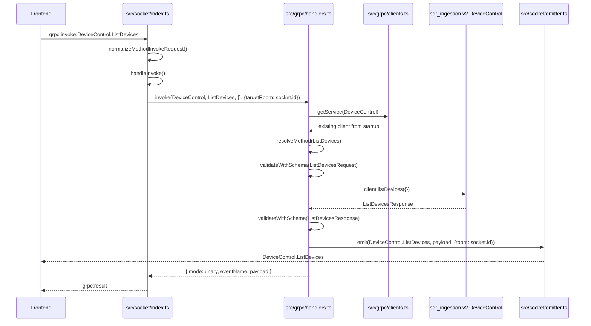

---

## 8.2) مثال متكامل رقم 2: التسلسل `ListDevices -> SubscribeSweep -> CloseDevice`

هذا هو المثال الأقرب لطلبك، مع توضيح مهم:

- لا يوجد RPC اسمه `StartSweep` في هذا المشروع
- البداية الفعلية للسويب تحصل عبر `SpectrumStream.SubscribeSweep`
- أي أن عبارة `start sweep` على مستوى الفرونت تعني عملياً إرسال event اسمه:

```text
grpc:invoke:SpectrumStream.SubscribeSweep
```

### المرحلة A: `ListDevices`

1. الفرونت يتصل أولاً ويستقبل `grpc:methods`.
2. يرسل `grpc:invoke:DeviceControl.ListDevices`.
3. الباك يلتقط الحدث في `src/socket/index.ts` كما في المثال السابق.
4. `gateway.invoke('DeviceControl', 'ListDevices', {}, { targetRoom: socket.id })`.
5. gRPC يعيد قائمة الأجهزة.
6. الباك يرسل:
   - `DeviceControl.ListDevices`
   - ثم `grpc:result`
7. الفرونت يختار جهازاً من `devices[]` ويأخذ مثلاً `deviceId`.

### المرحلة B: فتح الجهاز قبل السويب

حتى يبدأ السويب بشكل صحيح، الفرونت عادة يحتاج `sessionId` من `OpenDevice` أولاً، لأن `CloseDeviceRequest` وطلبات الستريم تعمل على session مفتوحة.

الفرونت يرسل مثلاً:

```text
grpc:invoke:DeviceControl.OpenDevice
```

مع payload مشابه:

```json
{
  "payload": {
    "deviceId": "rtlsdr:0",
    "centerFreqHz": "433920000",
    "sampleRateHz": 2400000,
    "gainMode": "GAIN_MODE_AGC"
  },
  "requestId": "open-sweep-001"
}
```

ثم يحصل المسار التالي:

1. `src/socket/index.ts` يلتقط `grpc:invoke:DeviceControl.OpenDevice`.
2. `normalizeMethodInvokeRequest()` يوحّد الرسالة.
3. `handleInvoke()` ينادي `gateway.invoke('DeviceControl', 'OpenDevice', payload, { targetRoom: socket.id })`.
4. `src/grpc/handlers.ts` يتحقق من `OpenDeviceRequest`.
5. يستدعي الـ client الجاهز مسبقاً:

   ```ts
   service.client.openDevice(parsedPayload, callback)
   ```

6. عند رجوع `OpenDeviceResponse`، يرسل الباك:
   - `DeviceControl.OpenDevice`
   - ثم `grpc:result`
7. من هذه النتيجة يحصل الفرونت على `sessionId`.

### المرحلة C: بدء السويب فعلياً عبر `SpectrumStream.SubscribeSweep`

الآن يرسل الفرونت event الستريم:

```text
grpc:invoke:SpectrumStream.SubscribeSweep
```

ومعه payload من نوع `SubscribeSweepRequest`، مثلاً:

```json
{
  "payload": {
    "sessionId": "sess-123",
    "startFreqHz": "430000000",
    "stopFreqHz": "440000000",
    "binWidthHz": 25000
  },
  "requestId": "sweep-001"
}
```

### مسار التنفيذ الدقيق لالتقاط حدث السويب

1. أول ملف يلتقط الحدث هو `src/socket/index.ts`.

2. السبب أن `createSocketServer()` عند اتصال العميل كان قد بنى listeners على كل method في `gateway.getServices()`، ومنها:

   ```ts
   socket.on('grpc:invoke:SpectrumStream.SubscribeSweep', async (message) => {
   ```

3. هذا الـ listener يستقبل الرسالة ثم يمررها إلى `normalizeMethodInvokeRequest()`.

4. بعد التطبيع، يستدعي `handleInvoke()` بالقيم:
   - `service = SpectrumStream`
   - `method = SubscribeSweep`
   - `payload = SubscribeSweepRequest`
   - `requestId = sweep-001`

5. `handleInvoke()` ينفذ:

   ```ts
   gateway.invoke('SpectrumStream', 'SubscribeSweep', payload, { targetRoom: socket.id })
   ```

6. هنا ينتقل التنفيذ إلى `src/grpc/handlers.ts`.

7. `resolveMethod()` يبحث عن `SpectrumStream` ثم `SubscribeSweep`.

8. يكتشف أن الـ method ليست unary بل `server-stream` لأن `responseStream = true`.

9. لذلك `invoke()` لا يدخل في مسار callback العادي، بل ينادي:

   ```ts
   startServerStream(service, method, payload, 'api', options?.targetRoom)
   ```

10. داخل `startServerStream()` يحدث التالي بالترتيب:
   - validation لـ `sdr_ingestion.v2.SubscribeSweepRequest`
   - بناء `streamKey`
   - فحص هل stream نفسها مفتوحة سابقاً أم لا

11. `streamKey` يُبنى من:
   - `fullServiceName`
   - `methodName`
   - `stableStringify(parsedPayload)`

12. هذا يعني أن streamين بطلبين مطابقين تماماً قد يعيدان استخدام نفس الاشتراك بدلاً من فتح stream ثانية.

13. إذا لم تكن stream موجودة، يتم تنفيذ استدعاء gRPC الفعلي:

   ```ts
   const call = (service.client as any)[method.clientMethodName](parsedPayload)
   ```

14. هنا `method.clientMethodName` تكون `subscribeSweep`.

15. إذن الـ client الذي أُنشىء وقت startup يبدأ الآن stream فعلية مع upstream gRPC server.

16. بعد فتح الـ stream، يخزن الباك entry داخل `activeStreams` تحتوي:
   - `streamKey`
   - `serviceName`
   - `methodName`
   - `eventName`
   - `payload`
   - `source = api`
   - `targetRooms = { socket.id }`

17. بعدها يربط ثلاثة listeners على الـ gRPC call:
   - `call.on('data')`
   - `call.on('error')`
   - `call.on('end')`

18. عند هذه النقطة فقط يعود `startServerStream()` بنتيجة فورية مثل:

   ```json
   {
     "streamKey": "...",
     "status": "started",
     "eventName": "SpectrumStream.SubscribeSweep"
   }
   ```

19. `gateway.invoke()` يعيد إلى `handleInvoke()`:

   ```json
   {
     "mode": "server-stream",
     "streamKey": "...",
     "status": "started",
     "eventName": "SpectrumStream.SubscribeSweep"
   }
   ```

20. `handleInvoke()` يرسل event واحداً فورياً إلى الفرونت:

   ```text
   grpc:result
   ```

21. هذه الرسالة لا تحمل traces نفسها، بل تحمل acknowledgment بأن الستريم بدأت أو أنها كانت موجودة مسبقاً.

### من أين تُلتقط رسائل السويب القادمة من gRPC وكيف تعود إلى الفرونت

1. عندما يرسل upstream أول `SweepTrace`، يتم التقاطها داخل `src/grpc/handlers.ts` في هذا listener:

   ```ts
   call.on('data', (message) => {
   ```

2. هذا هو المكان الفعلي الذي يستقبل فيه الباك رسائل الستريم من gRPC.

3. داخل هذا الـ listener ينفذ:

   ```ts
   emitValidatedMessage(service, method, message, currentStream.delivery)
   ```

4. `emitValidatedMessage()` يتحقق من response schema الخاصة بـ `SweepTrace`.

5. إذا كانت الرسالة صحيحة، ينادي `src/socket/emitter.ts`:

   ```ts
   emitter.emit(method.definition.eventName, validatedPayload, { room })
   ```

6. وبهذا يرسل السيرفر إلى الفرونت event العمل الحقيقي:

   ```text
   SpectrumStream.SubscribeSweep
   ```

7. كل trace لاحقة من gRPC تمر في المسار نفسه.

### المرحلة D: إغلاق الجهاز عبر `DeviceControl.CloseDevice`

بعد الانتهاء من السويب، يرسل الفرونت:

```text
grpc:invoke:DeviceControl.CloseDevice
```

ومعه payload مثل:

```json
{
  "payload": {
    "sessionId": "sess-123"
  },
  "requestId": "close-001"
}
```

### مسار التنفيذ الدقيق للإغلاق

1. `src/socket/index.ts` يلتقط `grpc:invoke:DeviceControl.CloseDevice`.
2. `normalizeMethodInvokeRequest()` تستخرج `payload` و `requestId`.
3. `handleInvoke()` ينادي:

   ```ts
   gateway.invoke('DeviceControl', 'CloseDevice', payload, { targetRoom: socket.id })
   ```

4. `src/grpc/handlers.ts` يدخل مسار unary.

5. يتم التحقق من `sdr_ingestion.v2.CloseDeviceRequest`.

6. ينفذ الاستدعاء الفعلي على gRPC client الجاهز:

   ```ts
   service.client.closeDevice(parsedPayload, callback)
   ```

7. عندما يعود `CloseDeviceResponse`:
   - ينفذ `emitValidatedMessage()`
   - يرسل `DeviceControl.CloseDevice` إلى نفس العميل
   - ثم يعود إلى `handleInvoke()`
   - ثم يرسل `grpc:result`

### ملاحظة مهمة جداً عن تنظيف stream بعد `CloseDevice`

`CloseDevice` بحد ذاته لا يستدعي داخل هذا الباك `releaseTarget()` تلقائياً.

هذا يعني أن تنظيف الاشتراك في `activeStreams` يحصل حالياً في حالة مؤكدة واحدة داخل الكود، وهي:

- عند `socket.on('disconnect')`

أي أن مسار الإغلاق المنطقي للجهاز شيء، ومسار تنظيف اشتراكات السوكت شيء آخر.

بالتالي إذا كان upstream gRPC يُنهي stream السويب تلقائياً بعد إغلاق الـ session، فسيصل أحد الحدثين التاليين داخل `startServerStream()`:

- `call.on('end')`
- أو `call.on('error')`

وعندها تُحذف من `activeStreams`.

أما إذا لم يُنهِ upstream الستريم تلقائياً، فتنظيفها النهائي يبقى مرتبطاً بانقطاع socket أو بإضافة منطق صريح لاحقاً لإلغاء الاشتراك.

### المخطط الكامل لهذا السيناريو

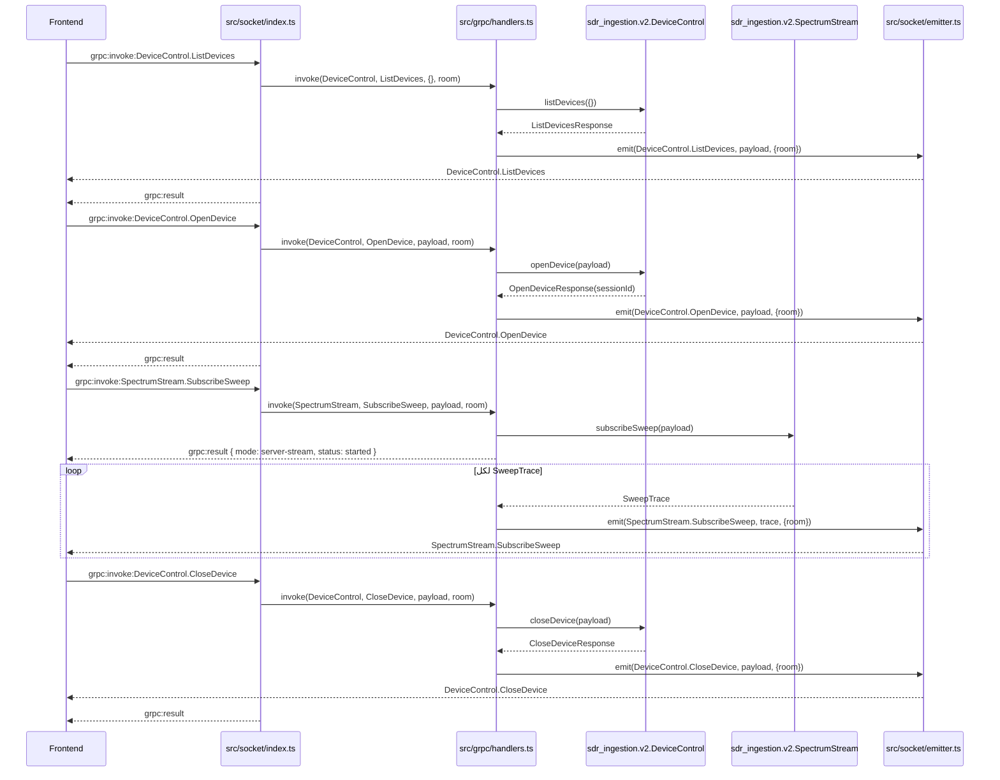

---

## 9) مسار تنظيف الاشتراكات عند Disconnect

عندما ينقطع عميل socket:

1. `src/socket/index.ts` يلتقط `socket.on('disconnect')`
2. ينادي `gateway.releaseTarget(socket.id)`
3. داخل `releaseTarget()` يتم المرور على كل `activeStreams`
4. إذا كان العميل ضمن `targetRooms` يتم حذفه
5. إذا لم يعد يوجد أي room لهذا stream وكان stream غير broadcast:
   - يتم `stream.call.cancel()`
   - يتم حذف الـ stream من `activeStreams`

### النتيجة

- لا تبقى streams خاصة بعميل ميت
- لا يحصل تسريب موارد بعد انقطاع العملاء

```mermaid
flowchart TD
    A[Socket disconnect] --> B[gateway.releaseTarget(socket.id)]
    B --> C{هل العميل مشترك في stream؟}
    C -- لا --> D[تجاهل هذا stream]
    C -- نعم --> E[احذف socket.id من targetRooms]
    E --> F{هل بقيت targetRooms؟}
    F -- نعم --> G[stream يبقى فعالاً]
    F -- لا --> H[call.cancel()]
    H --> I[احذف stream من activeStreams]
```

---

## 10) ماذا يحدث بالضبط عند `OpenDevice`

هذا هو المثال الأهم الذي طلبته: تتبع حدث واحد من الفرونت حتى الرد.

### الحدث من الفرونت

```text
grpc:invoke:DeviceControl.OpenDevice
```

### payload مثال

```json
{
  "payload": {
    "deviceId": "rtlsdr:2",
    "centerFreqHz": "24000000",
    "sampleRateHz": 1000000
  },
  "requestId": "open-001"
}
```

### التتبع التنفيذي

1. `src/socket/index.ts`
   الـ listener المسجل ضمن الحلقة `for (const method of methods)` يلتقط الحدث

2. يتم تمرير الرسالة إلى `normalizeMethodInvokeRequest()`
   لتوحيد الشكل إلى:
   - `payload`
   - `requestId`

3. يتم استدعاء `handleInvoke()` بهذه القيم:
   - `service = DeviceControl`
   - `method = OpenDevice`
   - `payload = {...}`
   - `triggerEvent = grpc:invoke:DeviceControl.OpenDevice`

4. `handleInvoke()` يستدعي:

   ```ts
   gateway.invoke('DeviceControl', 'OpenDevice', payload, { targetRoom: socket.id })
   ```

5. داخل `src/grpc/handlers.ts`
   `resolveMethod()` يجد service `DeviceControl`

6. يجد method `OpenDevice`
   ويعرف أنه unary

7. `validateWithSchema('sdr_ingestion.v2.OpenDeviceRequest', payload, logger)`
   تتحقق من:
   - أسماء الحقول
   - الأنواع
   - عدم وجود حقول زائدة غير معروفة

8. إذا كانت الـ payload صحيحة:
   يتم تحديد المهلة ثم استدعاء gRPC الفعلي على service client المناسب

9. عندما يصل رد gRPC:
   `emitValidatedMessage()` يتحقق من response schema ثم يرسل:

   ```text
   DeviceControl.OpenDevice
   ```

   إلى نفس socket فقط

10. ثم يعود `gateway.invoke()` إلى `handleInvoke()`

11. `handleInvoke()` يرسل بعدها:

   ```text
   grpc:result
   ```

### ترتيب الردود الفعلي للفرونت

الفرونت قد يرى عملياً:

1. `DeviceControl.OpenDevice`
2. `grpc:result`

أو قريباً جداً زمنياً بحسب ترتيب تنفيذ event loop

لكن منطقياً كلاهما يمثلان نجاح نفس العملية:

- `DeviceControl.OpenDevice` = business payload
- `grpc:result` = envelope منظم يصف ما حصل

### مخطط `OpenDevice`

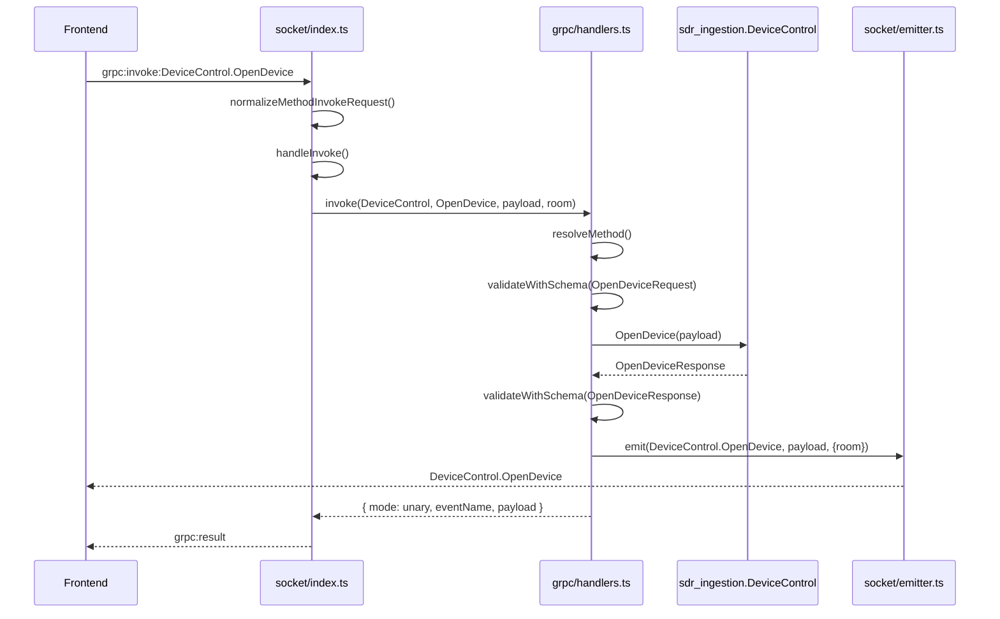

---

## 11) ماذا يحدث عند `DMRClassifier.ClassifyFrequency`

المسار مشابه لـ `OpenDevice` لكنه يذهب إلى target مختلف ويستخدم مهلة مختلفة.

### الحدث من الفرونت

```text
grpc:invoke:DMRClassifier.ClassifyFrequency
```

### داخل الباك

1. `src/socket/index.ts` يلتقط الحدث
2. `handleInvoke()` ينادي `gateway.invoke('DMRClassifier', 'ClassifyFrequency', payload, { targetRoom: socket.id })`
3. `resolveMethod()` يجد service `DMRClassifier`
4. الـ service client لهذا service تم إنشاؤه سابقاً على target `50062`
5. `validateWithSchema('dmr_classifier.v1.ClassifyFrequencyRequest', payload, logger)`
6. `resolveRequestTimeoutMs()` يقرأ المهلة الخاصة من البيئة
7. يتم استدعاء gRPC unary request
8. عند النجاح:
   - يرسل `DMRClassifier.ClassifyFrequency` إلى نفس العميل
   - ثم يرسل `grpc:result`

### لماذا هذه الخدمة تختلف عن `DeviceControl`

- target مختلف: `50062`
- مهلة override خاصة لأنها قد تتأخر أكثر من المهلة الافتراضية

---

## 12) ماذا يحدث عند `TETRAClassifier.ClassifyFrequency`

هذا أيضاً unary request لكن يذهب إلى target `50063`.

### الحدث من الفرونت

```text
grpc:invoke:TETRAClassifier.ClassifyFrequency
```

### المسار الداخلي

1. يصل الحدث إلى `src/socket/index.ts`
2. يمر عبر `handleInvoke()`
3. `gateway.invoke('TETRAClassifier', 'ClassifyFrequency', payload, { targetRoom: socket.id })`
4. `resolveMethod()` يجد service `TETRAClassifier`
5. service client الخاص به موجود على `50063`
6. يتم عمل validation للطلب
7. يتم اختيار المهلة من `GRPC_METHOD_TIMEOUTS`
8. يتم تنفيذ gRPC call
9. عند رجوع الرد:
   - `emitValidatedMessage()` يتحقق من response schema
   - يرسل `TETRAClassifier.ClassifyFrequency` إلى نفس العميل
   - ثم يرجع `grpc:result`

### نقطة مهمة

خدمة TETRA قد تستغرق عدة ثوانٍ لأن الخادم الخلفي قد ينتظر التقاط وتحليل frames قبل إنهاء الرد، لذلك تم رفع المهلة الخاصة بها أيضاً.

---

## 13) ماذا يحدث عند `IQStream.Subscribe`

هذا مثال على stream طويل الأمد.

### الحدث من الفرونت

```text
grpc:invoke:IQStream.Subscribe
```

### المسار

1. `src/socket/index.ts` يلتقط الحدث
2. `handleInvoke()` ينادي `gateway.invoke('IQStream', 'Subscribe', payload, { targetRoom: socket.id })`
3. `invoke()` يكتشف أن method من نوع server-stream
4. ينادي `startServerStream()`
5. يتم validation للطلب
6. يتم إنشاء `streamKey`
7. إذا كان stream مشابه موجوداً، يربط العميل عليه فقط
8. إذا لم يكن موجوداً، يفتح gRPC stream جديد
9. يرسل `grpc:result` إلى الفرونت مع:
   - `mode = server-stream`
   - `status = started` أو `already-active`
10. لاحقاً، كل message من gRPC تتحول إلى event:

```text
IQStream.Subscribe
```

### معنى ذلك للفرونت

- `grpc:result` هنا ليس الداتا الفعلية
- الداتا الفعلية تأتي لاحقاً على `IQStream.Subscribe`

---

## 14) ماذا يحدث عند `SignalRecorder.StartRecording` و `SignalRecorder.WatchRecording` و `SignalRecorder.DownloadRecording`

هذه الخدمة تضيف مسار تسجيل كامل فوق البوابة الحالية، وفيها 5 أوامر `unary` وأمران من نوع `stream`.

### `SignalRecorder.StartRecording`

الحدث من الفرونت:

```text
grpc:invoke:SignalRecorder.StartRecording
```

المسار الداخلي:

1. `src/socket/index.ts` يلتقط الحدث.
2. `handleInvoke()` ينادي:

   ```ts
   gateway.invoke('SignalRecorder', 'StartRecording', payload, { targetRoom: socket.id })
   ```

3. `resolveMethod()` يجد service `SignalRecorder`.
4. هذا service مربوط على target منفصل هو `50065` عبر إعدادات البيئة.
5. يتم validation للطلب باستخدام schema `signal_recorder.v1.StartRecordingRequest`.
6. يتم تنفيذ unary gRPC call على `SignalRecorder.StartRecording`.
7. عند النجاح:
   - يرسل الباك `SignalRecorder.StartRecording` إلى نفس العميل.
   - ثم يرسل `grpc:result`.

### `SignalRecorder.WatchRecording`

الحدث من الفرونت:

```text
grpc:invoke:SignalRecorder.WatchRecording
```

المسار الداخلي:

1. `src/socket/index.ts` يلتقط الحدث.
2. `handleInvoke()` ينادي:

   ```ts
   gateway.invoke('SignalRecorder', 'WatchRecording', payload, { targetRoom: socket.id })
   ```

3. `invoke()` يكتشف أن `WatchRecording` من نوع `server-stream`.
4. `startServerStream()` ينشئ stream جديد أو يعيد استخدام stream موجود لنفس `recordingId`.
5. يعود مباشرة `grpc:result` إلى الفرونت كـ acknowledgment.
6. بعد ذلك كل `RecordingEvent` قادم من gRPC يتحول إلى event socket اسمه:

   ```text
   SignalRecorder.WatchRecording
   ```

### `SignalRecorder.DownloadRecording`

الحدث من الفرونت:

```text
grpc:invoke:SignalRecorder.DownloadRecording
```

المسار الداخلي:

1. `src/socket/index.ts` يلتقط الحدث.
2. `handleInvoke()` ينادي:

   ```ts
   gateway.invoke('SignalRecorder', 'DownloadRecording', payload, { targetRoom: socket.id })
   ```

3. `invoke()` يكتشف أن `DownloadRecording` من نوع `server-stream`.
4. `startServerStream()` ينشئ stream جديد أو يعيد استخدام stream موجود لنفس `recordingId` و `chunkSizeBytes`.
5. يعود مباشرة `grpc:result` إلى الفرونت كـ acknowledgment.
6. بعد ذلك كل `DownloadRecordingChunk` قادم من gRPC يتحول إلى event socket اسمه:

   ```text
   SignalRecorder.DownloadRecording
   ```

7. chunk الأولى تحمل `metadata` عادة، والـ chunks اللاحقة تحمل `data`.

### التسلسل العملي المعتاد لهذه الخدمة

1. الفرونت يرسل `SignalRecorder.StartRecording`.
2. الباك يعيد `recordingId` داخل `SignalRecorder.StartRecording` وداخل `grpc:result`.
3. الفرونت يبدأ المراقبة عبر `SignalRecorder.WatchRecording`.
4. تصل updates الحالة على شكل stream.
5. لاحقاً يمكن للفرونت أن يرسل:
   - `SignalRecorder.GetRecording`
   - أو `SignalRecorder.StopRecording`
   - أو `SignalRecorder.DeleteRecording`
   - أو `SignalRecorder.DownloadRecording`

### مخطط تدفق التسجيل

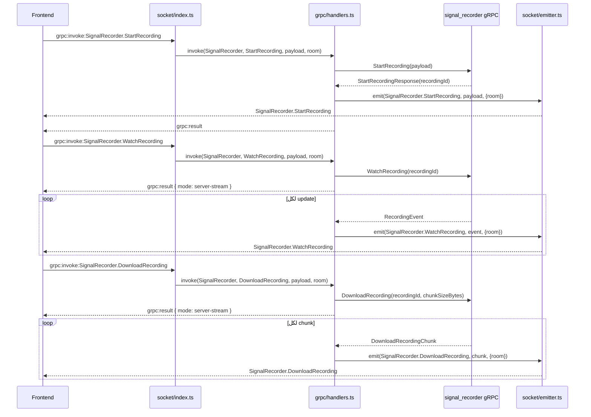

---

## 15) تتبع جميع أوامر الفرونت الموجودة حالياً

كل الأحداث التالية القادمة من الفرونت تنتهي داخل `src/socket/index.ts` ثم `handleInvoke()` ثم `gateway.invoke()`:

### أوامر unary

- `grpc:invoke:DeviceControl.ListDevices`
- `grpc:invoke:DeviceControl.OpenDevice`
- `grpc:invoke:DeviceControl.CloseDevice`
- `grpc:invoke:DeviceControl.SetFrequency`
- `grpc:invoke:DeviceControl.SetSampleRate`
- `grpc:invoke:DeviceControl.SetGain`
- `grpc:invoke:DeviceControl.SetFrequencyCorrection`
- `grpc:invoke:DeviceControl.GetDeviceState`
- `grpc:invoke:DeviceControl.SetHarogicConfig`
- `grpc:invoke:DeviceControl.ListSessions`
- `grpc:invoke:DMRClassifier.ClassifyFrequency`
- `grpc:invoke:TETRAClassifier.ClassifyFrequency`
- `grpc:invoke:SignalRecorder.StartRecording`
- `grpc:invoke:SignalRecorder.StopRecording`
- `grpc:invoke:SignalRecorder.GetRecording`
- `grpc:invoke:SignalRecorder.ListRecordings`
- `grpc:invoke:SignalRecorder.DeleteRecording`
- `grpc:invoke:SignalRecorder.DownloadRecording`

### أوامر streaming

- `grpc:invoke:IQStream.Subscribe`
- `grpc:invoke:SpectrumStream.SubscribeRTSpectrum`
- `grpc:invoke:SpectrumStream.SubscribeWaterfall`
- `grpc:invoke:SpectrumStream.SubscribeSweep`
- `grpc:invoke:SignalRecorder.WatchRecording`
- `grpc:invoke:SignalRecorder.DownloadRecording`

### القاعدة العامة للرد

#### إذا كان الطلب unary

يرد الباك على شكل:

1. `Service.Method`
2. `grpc:result`

أو إذا فشل:

1. `grpc:error`

#### إذا كان الطلب streaming

يرد الباك أولاً:

1. `grpc:result`

ثم لاحقاً:

2. `Service.Method` لكل chunk/frame/tile/trace

---

## 15) مسار الأخطاء بالتحديد

### أخطاء قبل الوصول إلى gRPC

هذه تحصل غالباً في `src/socket/index.ts` أو `validateWithSchema()`:

- payload ليس object صحيح
- `service` أو `method` غير موجودين في `grpc:invoke`
- أسماء حقول خاطئة مثل `snake_case`
- وجود حقول غير معرفة

الرد يكون:

```text
grpc:error
```

مع `statusCode = 400`

### أخطاء بعد استدعاء gRPC

هذه تحصل إذا:

- الخدمة غير موجودة على upstream target
- الـ method غير مطبق
- الخادم الخلفي أعاد خطأ gRPC
- انتهت المهلة

الرد أيضاً يكون:

```text
grpc:error
```

مع status مناسب مثل:

- `400`
- `404`
- `502`
- `504`

### مخطط مبسط لمسار الخطأ

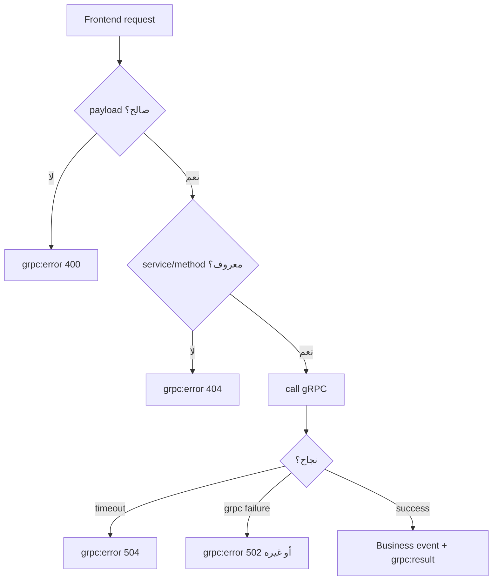

---

## 16) المسار البديل عبر HTTP API

إضافة إلى الـ socket، يوجد REST interface بسيط:

- `GET /health`
- `GET /services`
- `GET /events`
- `POST /invoke/:service/:method`

### المسار الداخلي

1. `src/api/routes.ts` يربط المسارات
2. `src/api/controller.ts` يستقبل الطلب
3. `controller.invoke()` ينادي `gateway.invoke(service, method, request.body ?? {})`
4. النتيجة تعود JSON عبر HTTP response مباشرة

### الفرق عن socket

- في HTTP لا يوجد `targetRoom`
- في unary قد يحصل broadcast إذا تم استخدام `emitValidatedMessage()` بدون room محدد
- هذا يعني أن socket path هو المسار الأدق عندما تريد استجابة موجهة للعميل الطالب فقط

---

## 17) تعريفات الحالات الأساسية للنظام

يمكن فهم النظام على 4 حالات تشغيلية عامة:

### 1. Startup State

- proto files يتم تحميلها
- clients يتم إنشاؤها
- readiness checks تتم

### 2. Connected Client State

- العميل متصل عبر socket
- استلم `grpc:methods`
- قادر على إرسال أوامر

### 3. Unary In-Flight State

- طلب واحد قيد التنفيذ
- ينتظر رد gRPC أو timeout

### 4. Streaming State

- يوجد stream فعّال داخل `activeStreams`
- كل رسالة gRPC تتحول إلى event socket

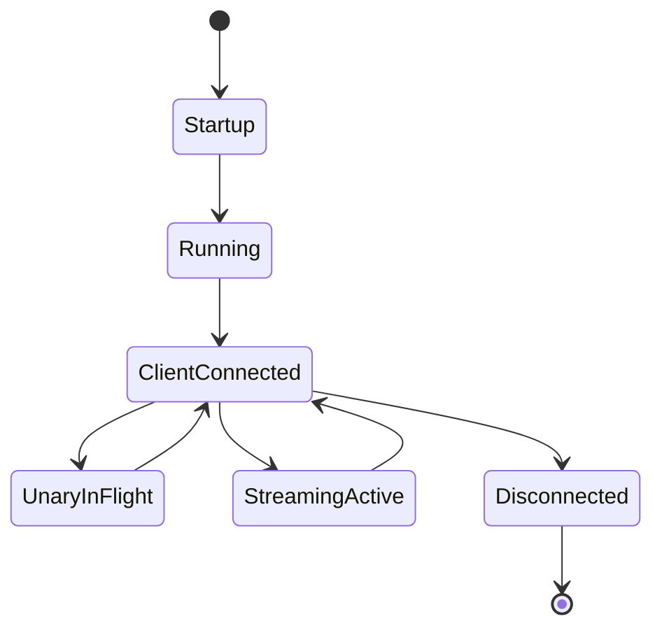

---

## 18) خلاصة عملية سريعة جداً

إذا أردت أن تراقب أي أمر من الفرونت وتفهم مساره، فهذه القاعدة المختصرة تكفي:

1. الحدث يدخل من `src/socket/index.ts`
2. يمر غالباً عبر `handleInvoke()`
3. يذهب إلى `gateway.invoke()` في `src/grpc/handlers.ts`
4. هناك يتم:
   - resolve service/method
   - validate request
   - unary أو streaming decision
   - gRPC call
   - validate response
   - emit business event
5. أخيراً يعود:
   - `grpc:result` إذا نجح
   - `grpc:error` إذا فشل
6. وإذا كان stream فالداتا الفعلية تستمر على event العمل نفسه

---

## 19) كيف تستخدم هذا الملف أثناء التتبع العملي

إذا أردت تتبع أي حدث جديد لاحقاً، استخدم هذا الترتيب:

1. حدّد اسم event القادم من الفرونت
2. ابحث هل هو unary أم stream في `src/grpc/registry.ts`
3. راقب التقاطه في `src/socket/index.ts`
4. راقب مروره في `gateway.invoke()` داخل `src/grpc/handlers.ts`
5. حدّد أي request schema وأي response schema يتم تطبيقهما
6. حدّد target الخدمة في `src/grpc/clients.ts` و `.env`
7. راقب أي event عمل سيعود إلى الفرونت
8. راقب envelope النهائي: `grpc:result` أو `grpc:error`

بهذا الشكل يصبح تتبع أي عملية في المشروع واضحاً وممنهجاً، وليس مجرد مراقبة أسماء events فقط.